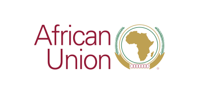
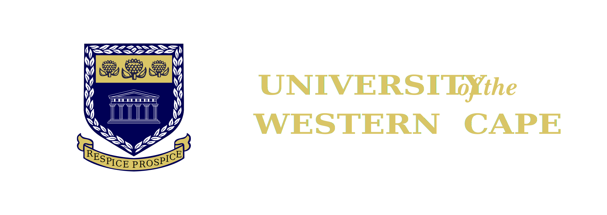

## Programme

The course is a two week (10 days) programme of in-person instruction combining theoretical back with practical instruction and opporunity for hands-on practice of the skills presented.

<!-- LEAVE THIS TABLE ALONE - the rest of the page continues where it says BELOWTHETABLE -->

<table>
  <tr class="weekheader">
    <td colspan="6">
      <strong>Week 1</strong>
    </td>
  </tr>
  <tr style="border: 1px solid black;">
    <td></td>
    <th>Day 1 (Mon)</th>
    <th>Day 2 (Tue)</th>
    <th>Day 3 (Wed)</th>
    <th>Day 4 (Thu)</th>
    <th>Day 5 (Fri)</th>
  </tr>
  <tr>
    <td>09h00</td>
    <td>Introduction Unix/Linux, command line, shell scripting </td>
    <td>Package management with Conda </td>
    <td>Containers</td>
    <td>Nextflow</td>
    <td>R</td>
  </tr>
  <tr class="break">
    <td>11h00</td>
    <td colspan="5">Tea Break</td>
  </tr>
  <tr>
    <td>11h30</td>
    <td>Introduction Unix/Linux, command line, shell scripting </td>
    <td>Package management with Conda </td>
    <td>Containers</td>
    <td>Nextflow</td>
    <td>R</td>
  </tr>
  <tr class="break">
    <td>13h00</td>
    <td colspan="5">Lunch Break</td>
  </tr>
  <tr>
    <td>14h00</td>
    <td>Introduction Unix/Linux, command line, shell scripting</td>
    <td>Package management with Conda</td>
    <td>Containers</td>
    <td>R</td>
    <td>R</td>
  </tr>
</table>

<table>
  <tr class="weekheader">
    <td colspan="6"><strong>Week 2</strong></td>
  </tr>
  <tr>
    <td></td>
    <th>Day 6 (Mon)</th>
    <th>Day 7 (Tue)</th>
    <th>Day 8 (Wed)</th>
    <th>Day 9 (Thu)</th>
    <th>Day 10 (Fri)</th>
  </tr>
  <tr>
    <td>09h00</td>
    <td>R</td>
    <td>Galaxy</td>
    <td>Cholera case study</td>
    <td>Cholera case study</td>
    <td>Bioinformatics networking</td>
  </tr>
  <tr class="break">
    <td>11h00</td>
    <td colspan="5">Tea Break</td>
  </tr>
  <tr>
    <td>11h30</td>
    <td>R</td>
    <td>Galaxy</td>
    <td>Cholera case study</td>
    <td>Cholera case study</td>
    <td>Bioinformatics networking</td>
  </tr>
  <tr class="break">
    <td>13h00</td>
    <td colspan="5">Lunch Break</td>
  </tr>
  <tr>
    <td>14h00</td>
    <td>Galaxy</td>
    <td>Cholera case study</td>
    <td>Cholera case study</td>
    <td>Cholera case study</td>
    <td>Bioinformatics networking</td>
  </tr>
</table>

<!-- BELOWTHETABLE -->

## Partners

This course is being organised by [SANBI](https://www.sanbi.ac.za/) (the South African National Bioinformatics Institute) at the 
[University of the Western Cape (UWC)](https://www.uwc.ac.za/) in collaboration with [Africa CDC](https://africacdc.org) (the Africa Centres for Disease Control and Prevention), part of the African Union (AU), [CBIO](https://health.uct.ac.za/computational-biology/) (the Computational Biology Department at the University of Cape Town)

  
  
  
  

