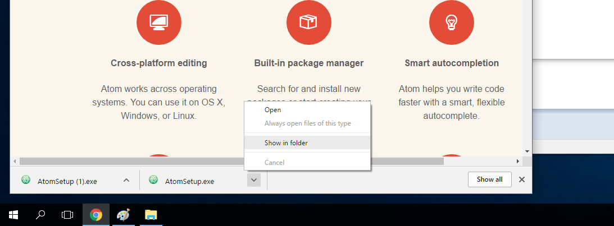
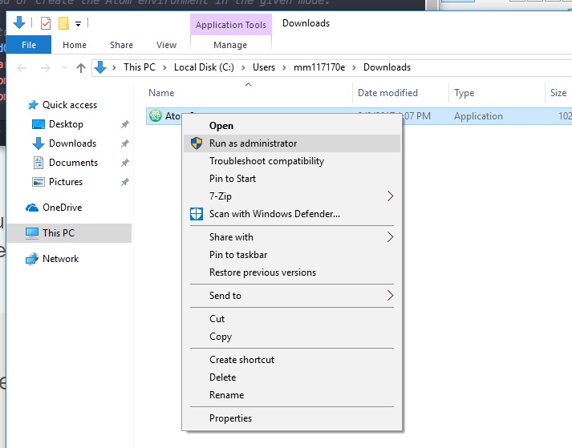
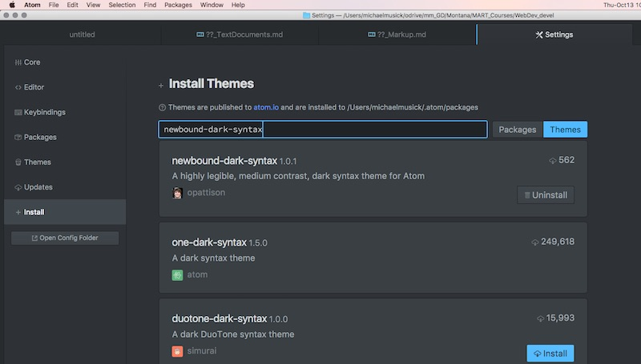
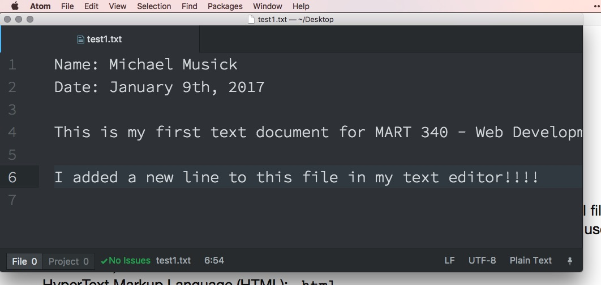

# Text Editors

## Text Editors Overview

As mentioned in this weeks overview, a text editor is any application for editing ASCII text documents. This includes both prose or code documents. There are many types of text editors. The various types of text editors are optimized for specific types of tasks.

Please read this [Wikipedia page on text editors](https://en.wikipedia.org/wiki/Text_editor) to familiarize yourself with some of the specifics and differences. Pay particular attentions to the “Typical Features” section.

## Text Editor for Development

For this class, we need a text editor that is optimized for web development and code. You are welcome to use whatever text editor you like for this course, however, the following should be considered;

- GitHub’s [Atom](https://atom.io) - Open Source (ie. Free)
- Adobe’s [Brackets](http://brackets.io) - Open Source
- [Sublime Text 3](https://www.sublimetext.com/3) - License is $70

I have used both Atom and Sublime Text extensively. Currently, I am teaching with Atom, and as such, will describe the creation of a development environment through Atom.

<iframe class="embed-responsive-item" src="https://www.youtube.com/embed/Gbq9ZWXtyK4" frameborder="0" allowfullscreen></iframe>

###### Install on macOS

To install atom on macOS, simply download the software. Then drag the application that was downloaded from the Downloads folder to the Applications folder. See this is in the video above.

###### Install on Windows

To install atom on windows, download the windows installer from the main [atom.io](https://atom.io) site.

**IMPORTANT:** when the download finished, do not simply double-click from the bottom of the browser window. Instead, you first need to open the file in explorer. To do this you can either open explorer and navigate to the folder where it downloaded (likely "Downloads") _OR_, right-click or two-finger-click the file from the browser and select "Show in Folder". 

From the explorer you then need to right-click the file and select "Run as Administrator". This is especially important if you are not sure whether you are signed in as an admin. 

### { TODO: }
1. Explore various text editors through your browser.
2. After identifying one that you believe will fit your needs, download and install the application to your computer.
3. Open the text editor and familiarize yourself with its features.

## Packages
Most text editors allow you to download additional packages created by the community which extend their functionality and can make them more suited to your particular needs.

In Atom for instance, you can install new packages by selecting the “install” tab from the preferences page. From there you can search for packages to install or themes to install. The former adds functionality to your editor and the latter allows you to customize the look and feel of the editor. From time to time, I may suggest packages that would be useful for you if you are working in Atom. The image shows a search for the newbound-dark-syntax, which provides colorization for a number of languages, including markdown. (I would suggest you install this theme, and then select it as your “Syntax Theme” under the Themes tab.)

Initially, I would also suggest you search for and install the following packages in Atom;

- highlight-selected; This will highlight all occurrences of a selected word. This is useful for debugging.
- fonts; Lots of fonts that can easily be selected for use in Atom.
- file-icons; displays file type icons next to files in the sidebar.
- language-markdown; Adds syntax support to themes without markdown syntax.
- todo-show; Tools for showing “TODO”-s in code.
- linter; base package to show code errors
	- html linter
	- css linter
- open-recent; Adds “open recent” functionality to the File menu in Atom.
- pigments; display colors in files.
More can be found on the [scotch websites discussion of Atom](https://scotch.io/bar-talk/best-of-atom-features-plugins-acting-like-sublime-text)

### { TODO: }

- Open your file from the previous page (`test1.txt`) in your text editor application.
- Add a new line to the end of the file that says the following: `I added a new line to this file in my text editor!!!!`
- Save the file.

Also, do a Google search on the text editor you picked in order to query how others use it. You might look for something like “Atom best packages”, “optimize Atom for web development”. This is not to suggest you follow these results, but rather to inform you of the possibilities of your chosen text editor.
