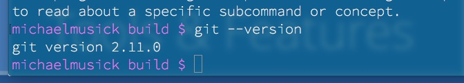
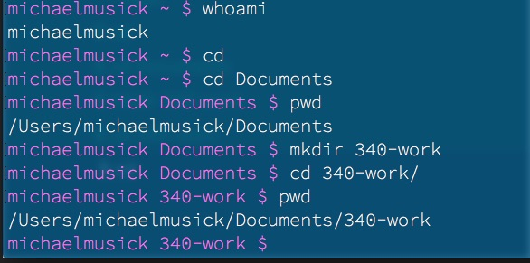
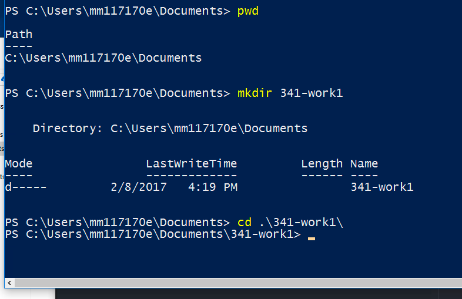

# GIT Version Control System

One great thing about working with text files is that their simplicity makes it easy to track changes between various versions of a file. Since the files contain only [ASCII](http://www.asciitable.com) characters, it is easy to create programs that can look for character or word level changes to a document.

## Why use Version Control?

- Version control allows a developer/writer to make changes to a file and track their changes over time. By ‘committing’ changes to a file with a simple, associated message, the developer can create a list of how they have changed the file over time.
- Version control also allows for a developer/writer to make changes that may or may not work. If they find that the change they made was inappropriate, or did not work, they can simply go back to a previous version. There is no need for directories full of “save as” files.
- Version control makes collaboration and sharing easier. Then all associated parties can see all changes made by each other, and manage any conflicts that may occur within a file.

<div class="embed-responsive embed-responsive-16by9"><iframe class="embed-responsive-item" src="https://player.vimeo.com/video/41027679" frameborder="0" webkitallowfullscreen mozallowfullscreen allowfullscreen></iframe></div>


## More about GIT
Please read sections 1.1-1.3 in the following online book about Git. [Pro Git - TOC](https://git-scm.com/book/en/v2)


## Why are we using GIT

- I want you to use GIT so that you can track incremental changes to your work throughout your weekly assignments.
	- This will allow you to see your own change history.
	- This will allow you to try things, and know that if they do not work well, you can easily go back to what you had working before.
- Your git repositories (or repo’s) can easily be integrated with GitHub.com (discussed in the next section). This gives;
	- Built in distributed cloud backup for free.
	- A free hosted webspace. (This is how you will submit assignments during most of the course).
	- This allows me and the graduate instructors to easily see your work/code and track the changes you made during the weekly development cycle.
- The last reason you will be using GIT is because it is a standard industry tool in both commercial and research facilities. Your familiarity and comfort with it will make you a better future collaborator.

# Installing and Setting Up Git

## Installation
Mac and Linux users likely have Git already installed on their machines. To checkout open terminal.app and execute the following command

```bash
git --version
```



If you saw something like the above returned then you have git.

If you did not have git installed, want the latest version, or are on Windows then follow the install instructions from [chapter 1.5 of the “Pro Git” book](https://git-scm.com/book/en/v2/Getting-Started-Installing-Git) or the [Atlassian Tutorial Site](https://www.atlassian.com/git/tutorials/install-git).

NOTE: Windows users:

1. Just as with Atom, please open the file in file explorer, then right-click the installer and select "Run as Administrator".
2. please make sure you check the box electing to use Git from the Windows Command Prompt / PowerShell.

Once Git is installed, open PowerShell / Terminal and run the above command (`git --version`). Everyone should now have git installed on their computer. If this did not work, shut down all command line applications (PowerShell, Command Line, Git Bash, Terminal, etc). Then reopen and try again.


## Setup
After installing Git you should follow the instructions from [chapter 1.6 of the Pro Git book on “First-Time Git Setup”](https://git-scm.com/book/en/v2/Getting-Started-First-Time-Git-Setup).

<div class="embed-responsive embed-responsive-16by9"><iframe class="embed-responsive-item" src="https://www.youtube.com/embed/vGRM2O5PgI8" frameborder="0" allowfullscreen></iframe></div>

The main thing to do is to set your username and email address. This is done with the following two lines of code in terminal or Command Line. (note: do not copy the '$'. This is a convention to show a new line in terminal/Command Prompt. Instead copy the rest of the line starting at the first character after the dollar sign. If a line does not start with a ‘`$`’, it is text output from the computer. Do not copy these lines.)

```bash
$ git config --global user.name "John Doe"
$ git config --global user.email johndoe@example.com
```

# Git Basics
This section will refer to [Chapter 2 in the Pro Git book](https://git-scm.com/book/en/v2/Git-Basics-Getting-a-Git-Repository). You need to read this chapter.

OK, lets learn some Git. Open `terminal.app` if you are on macOS/Linux or `PowerShell.exe` on Windows.

<br />
<div class="embed-responsive embed-responsive-16by9"><iframe class="embed-responsive-item" src="https://www.youtube.com/embed/3fZ-QCl7HC8" frameborder="0" allowfullscreen></iframe></div>
<br />
<br />

### Step 1 - Create an Empty Directory
Navigate to a location on your system hard drive where you want to store all of your work for this course from this semester. I would suggest somewhere like your `/Documents` directory.

In there create a new directory called `341-work`.

Then navigate into the `/341-work` directory.

<!-- *(Example code for unix)* -->
```bash
$ cd
$ cd Documents
$ mkdir 341-work
$ cd 341-work
```

#### Example of creating directory on mac



#### Example of creating directory on PC



### Step 2 - Initialize the Directory as a Git Repository
Make the new directory a Git repository.

The first thing your are going to do is tell Git to create a new repository within this directory. To do so, we will call the ‘git’ command followed by the ‘init’ command `git init`. This will initialize a new repository.

```bash
$ git init
Initialized empty Git repository in /Users/musick/Documents/341-work/.git/
```


### Step 3 - Add a File to the Repo
Add a file to the repository.

Move the test1.txt file we created earlier into the new directory. You can do this by grabbing it with your mouse and drag/drop-ing it to the new directory, or use the `mv` command in the terminal.

After moving the file to the directory, we need to tell the Git repository to “track” this file. To do this, we tell git to `add` all files to the repository `git add *`. (The `*` serves as a wildcard telling the terminal to find all files in the current directory.

```bash
$ git add *
```

### Step 4 - Commit Changes
Commit the changes to the repository.

The last step is to create a commit message officially tracking these changes in the repository. `git commit -m 'initial commit for the repository and test1.txt'`

```bash
$ git commit -m 'initial commit for the repository and test1.txt'

[master (root-commit) 14bc786] initial commit for the repository and test1.txt.
 1 file changed, 7 insertions(+)
 create mode 100644 test1.txt
```

### Step 5 - Check the Repo Status
Check the repository status.

Finally, lets check the status of our new repository with the command `git status`. This should tell us everything is as expected, tracked, and committed.

```bash
$ git status
On branch master
nothing to commit, working tree clean
```

## Tracking Changes
One of the most powerful uses of Git, as previously mentioned, is its ability to track changes to files within your repository. Let’s take a look at how we can accomplish this.

### Step 1 - Make Changes to the File

Change the file and re-save it.

The first thing to do is open our `test.txt` file in a Text Editor (Atom). Then make some changes, additions, or deletions. Finally re-save this file.

If we now check the status of our Git repo, it will tell us that the repository is no longer up-to-date.

```bash
$ git status
On branch master
nothing to commit, working tree clean
```

### Step 2 - See Whats Changed

Use `git diff`

Using the `git diff` command we can see how all files have changed since their last commit.

NOTE: this will not return any information on Windows.

```bash
$ git diff
diff --git a/test1.txt b/test1.txt
index 01ae4da..db32022 100644
--- a/test1.txt
+++ b/test1.txt
@@ -1,7 +1,14 @@
 Name: Michael Musick
 Date: January 11th, 2017

-This is my first text file! YEAH!!!!
+This is my first text file! WOW!!!!
+That has now been altered!


-I added a new line to this file in my text editor!!!!
+I added this file in my text editor!!!!
+
+Adding a new line.
+And another.
+
+
+HAHAHAHAAHAAAAAAA

```

Lines that start with a ‘-‘ are “deletions” from the file, while lines that start with a “+” are additions to the file.

### Step 3 - Stage the Altered File

Stage the recently altered file with the `add` command.

After changing a file, we must tell Git the we want it to keep a snapshot of those changes. To do this, we tell git to “add” the change file to its staged files.

```bash
$ git add *

```

 If we check the status again, we will see that Git has staged the file, but not committed these changes yet.

```bash
$ git status
On branch master
Changes to be committed:
  (use "git reset HEAD <file>..." to unstage)

    modified:   test1.txt
```

### Step 4 - Commit Changes

Finally, just as before, we commit all of our changes and add a commit message.

```bash
$ git commit -m 'made changes to test1.txt'
[master 2737075] changes some things in test1.txt
 1 file changed, 9 insertions(+), 2 deletions(-)
```

## Viewing Commit History

The last major thing you may want to do, is view the commit history of this Git Repo. To do this, we simply pass the command `git log`. This show us relevant information for each commit.

```bash
$ git log
commit 27370758978860f09dd980f00b30c6a99bde881c
Author: Michael Musick <michael@michaelmusick.com>
Date:   Wed Jan 11 13:49:03 2017 -0700

    changes some things in test1.txt

commit 14bc78618f5c946baa26e229ff9477706688fc8f
Author: Michael Musick <michael@michaelmusick.com>
Date:   Wed Jan 11 13:44:49 2017 -0700

    initial commit for our new repo. Also added the test1.txt file.
```

## { TODO: }
Practice adding and changing files within your new Git repo. If you are having problems, return to the [Pro-Git book](https://git-scm.com/book/en/v2).

Please watch the following videos to learn more about Git.
<div class="embed-responsive embed-responsive-16by9"><iframe class="embed-responsive-item" src="https://player.vimeo.com/video/41381741" frameborder="0" webkitallowfullscreen mozallowfullscreen allowfullscreen></iframe></div>

<div class="embed-responsive embed-responsive-16by9"><iframe class="embed-responsive-item" src="https://player.vimeo.com/video/41493906" frameborder="0" webkitallowfullscreen mozallowfullscreen allowfullscreen></iframe></div>

For additional resources check out the [Git curated “External Links” page](https://git-scm.com/documentation/external-links).
