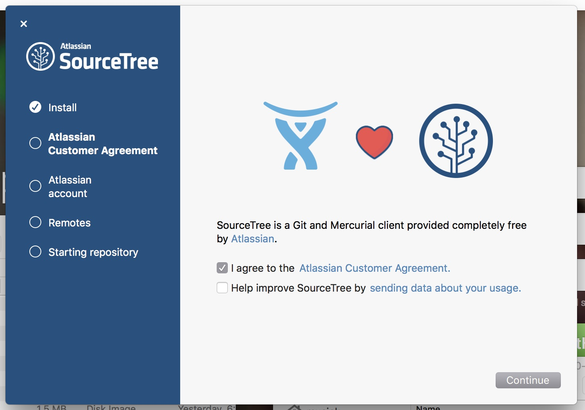
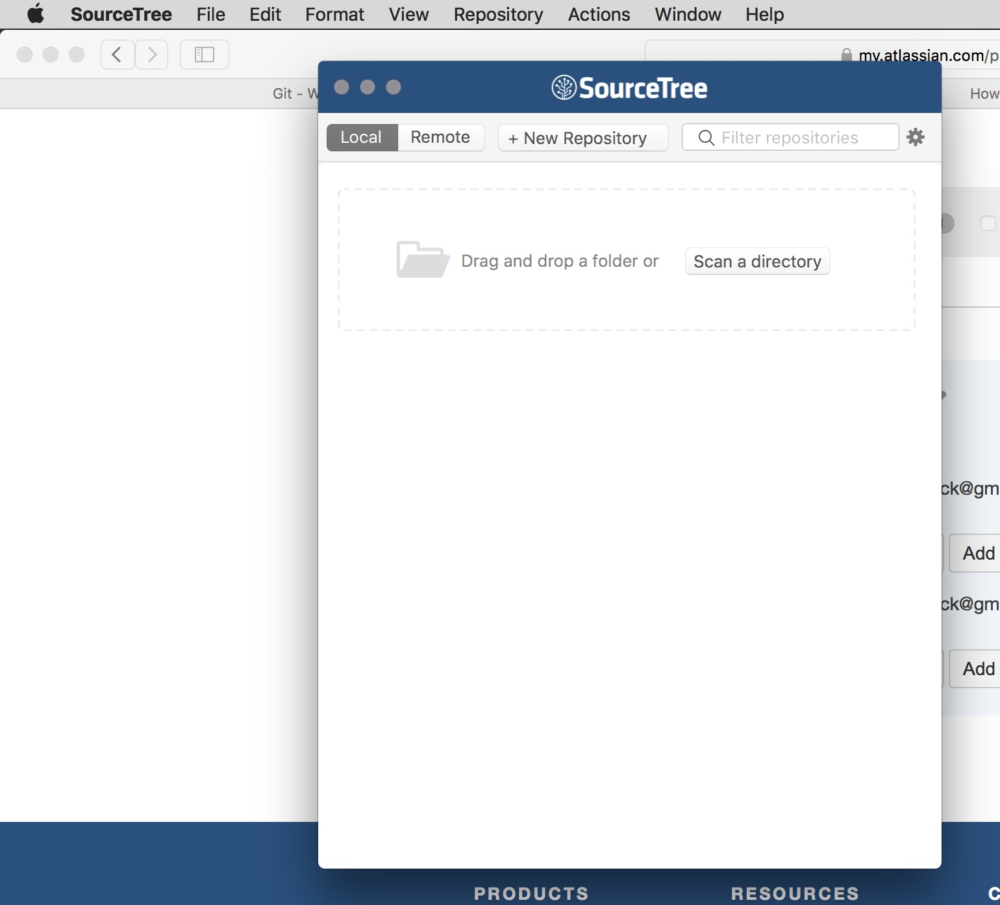
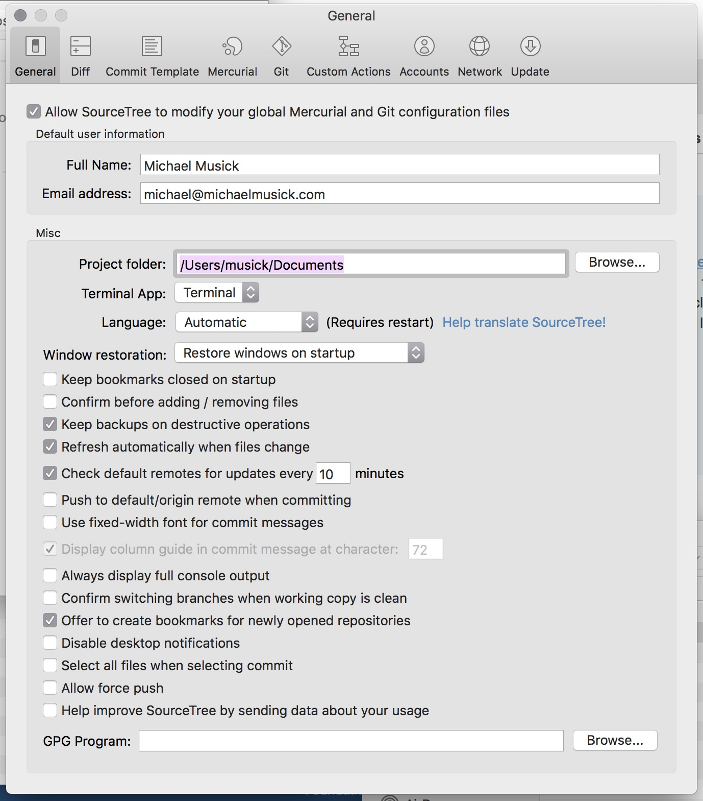
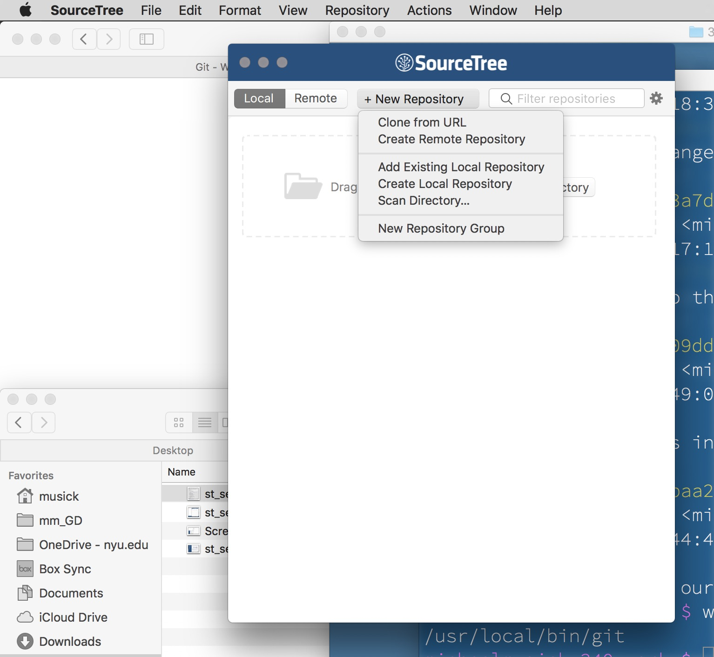
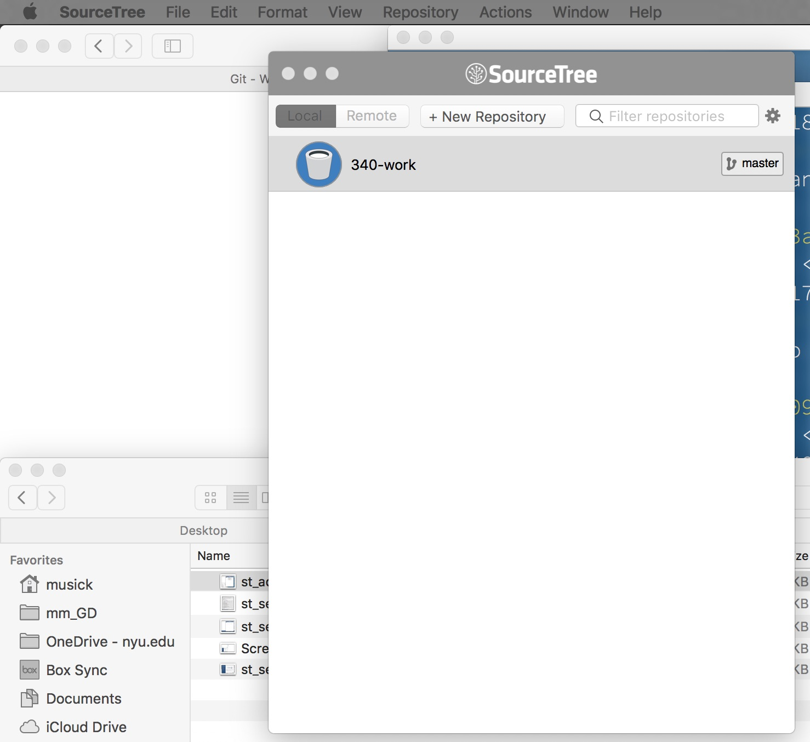
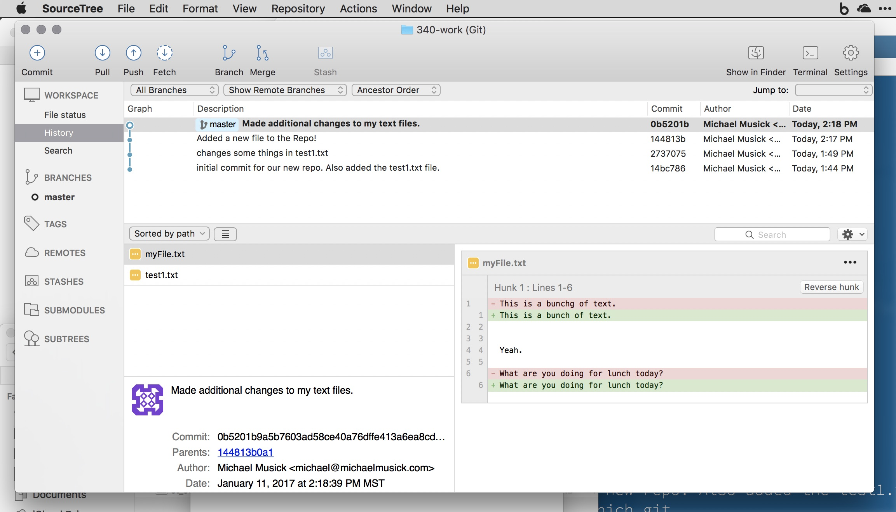
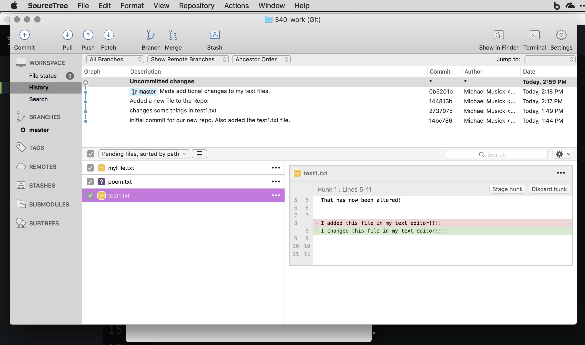
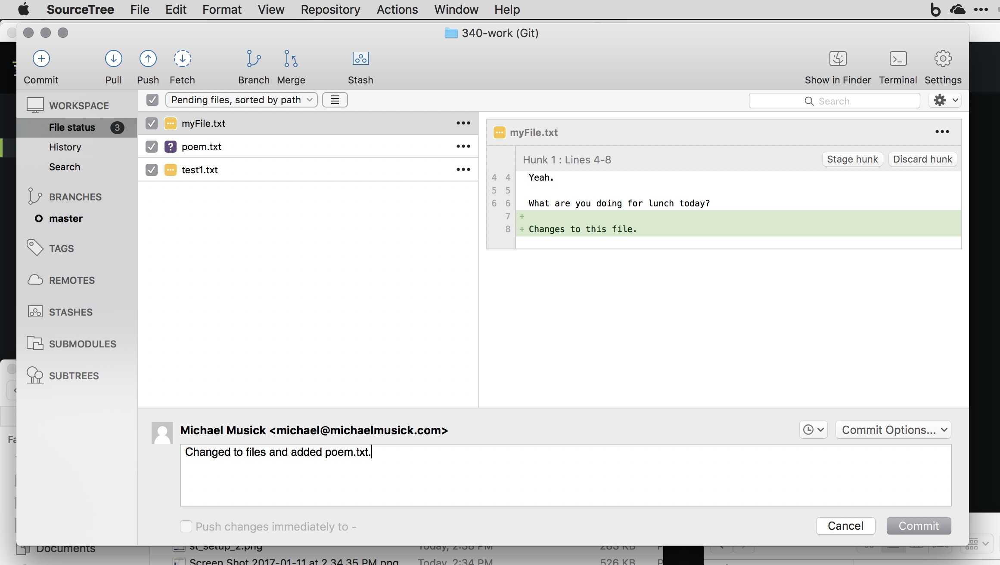

# Git GUI Applications

Working with Git in the terminal offers the user the full power of Git. However, there are GUI (pronounced ‘gooey’. GUI stands for ‘graphical user interface’) applications that can serve as a front-end for Git. You are free to use the terminal/cmd.exe or one of these applications.

The two applications I would suggest are;

- [SourceTree](https://www.sourcetreeapp.com) (recommended)
- [GitHub Desktop](https://desktop.github.com)

Both of these work on macOS and Windows.

I will show you how to use Source Tree, but the process of using GutHub Desktop is virtually the same.

## Setting Up “SourceTree”
After downloading the application, you should follow the installer instructions for Windows, or simply drag it to your /Applications directory for macOS.

When you open the app for the first time, you will be guided through an additional setup process.

You must agree to the “Atlassian Customer Agreement”, and it is your choice about whether you want to provide them with “usage data”.

You will then need to follow the “Go to My Atlassian” to create an account. This is necessary to register the app. After creating an account, go back to the Source Tree app and click the “Use an existing account” button. Then sign in.

Skip the “Connect an account” setup page for the time being.

You should then see the “Repository Browser” window, which will be empty for you. (If you do no see this window, go to the Window tab in SourceTree and select “Show Repository Browser”.)

Finally, open the SourceTree preferences. In there you should enter your name and e-mail (just as we did in the terminal). You should also change the default “Project folder:” path to look at your /Document directory.

## Add Our Existing Git Repo
Now that SourceTree is setup, lets add our existing Git Repo. To do this, select the “+ New Repository” tab in the SourceTree Repository Browser window. This will open a dropdown menu, from which you should select the “Add Existing Local Repository”.

This should open a “Finder” window, from which you need to navigate to the top level of your repository. Then select “Open”.

This should create a new Repo in your Repository Browser Window labeled the name of your repository directory (“341-work”).

To view the Repo, double click on it in the Repository Browser. This will open a repository window.

If it is not already selected, select “History” from the “WORKSPACE” sidebar on the left. This shows your “commit history” in the main WORKSPACE window.

In the WORKSPACE, you can see each commit that has been made, along with the “commit author” and date of the commit. If you click on a commit, it will show the files that were effected down below. Selecting a file shows the differences that occurred between commits.

In the top bar, you should see some familiar buttons. The “Commit” button is used to make commits. The “Show in Finder” and “Terminal” buttons can be used to open the repo in the Finder or Terminal respectively.

## Make a Commit
Go back to your text editor, and make some changes to the existing text file. You should also add a new file in the repository directory and place some random text within it.

After making these changes, come back to the repo window in SourceTree. There should now be a new entry in the history WORKSPACE with the description “**Uncommitted changes**”. Select that line. You should then see All changed or “pending file changes” below. Notice that selecting a file shows the changes that you made. Also notice how the file that previously existed is pre-selected, whereas the new file you added is not. We want to add this new file as well as the changes made to our old files. So make sure every file is selected. This is how you “stage” files for commit in SourceTree.

Once you have made sure all the files are selected, you should click the “Commit” button in the top-left corner of the window.

The window that comes up is how we make commit messages. In the text box under your name, you should add an appropriate commit message. Then hit the commit button in the lower-right corner of the window.

You will be asked to “Confirm Add?” For the new file. Select the “Do not show this message again” box and click “OK”.

There should now be a new commit in your Repo window with the message that you just entered.

Again, selecting different commits will show the files changed for each one. Selecting those files will show how they changed from the last commit.

<iframe class="embed-responsive-item" src="https://www.youtube.com/embed/s0iPveZHsfA" frameborder="0" allowfullscreen></iframe>

## { TODO: }

Practice adding and changing files within your Git repo using the GUI Git app of your choice. Try to decide if you want to use an app or the terminal/command line.
