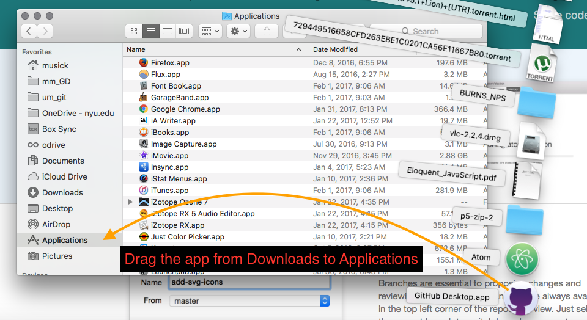
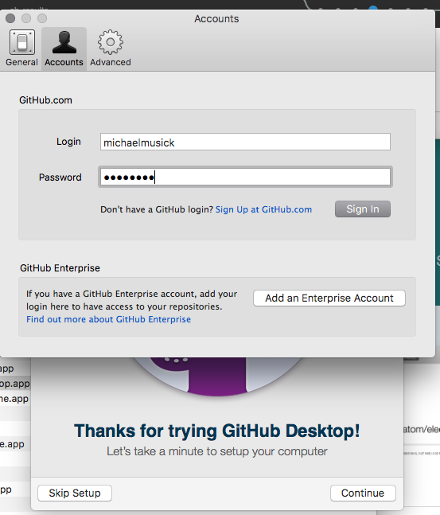
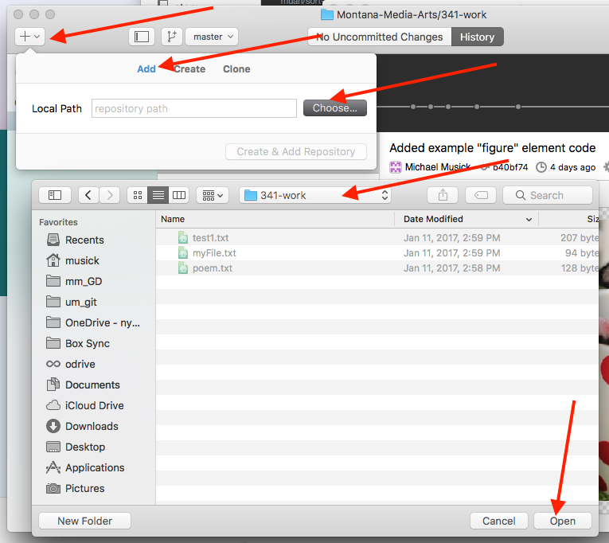
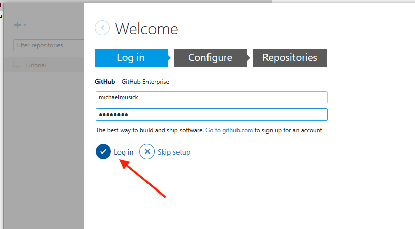
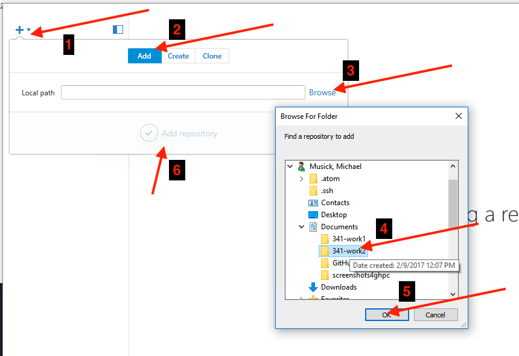
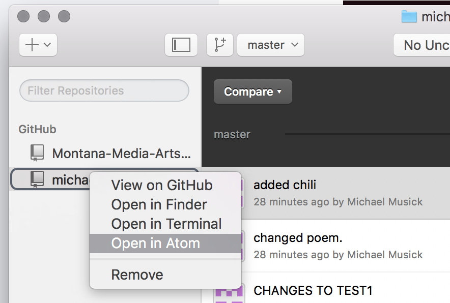
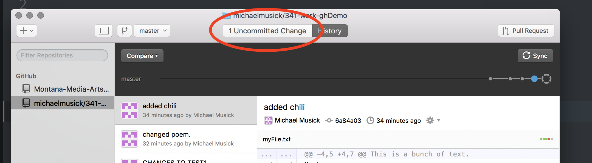

# Git GUI Applications - GitHub Desktop

Download the GitHub Desktop appliction from their site.
https://desktop.github.com

## on macOS

After downloading the application, simply drag it to your /Applications directory for macOS.

When you open the app for the first time, you will be guided through an additional setup process.

#### 1. Login to GitHub

First, click continue. Then, login to GitHub with your username & password.

#### 2. Configure Git

On the "Configure Git" screen, enter your name and email, if they are not already there.

You should also click the box that says "Install Command Line Tools".

Then click "continue" again.

#### 3. "Find Local Repositories"

GitHub will look for your local (i.e. the repo's on your computer) and make it easy for you to add them. You can do that now if they show up, or add them later. (Skip the add repo step below, if you add them now.)

#### 4. Add your Repo

To add a local repo, you need to click the "+" button in the upper-left hand corner of the application window.

Then click the "add" tab.

Finally, click "choose", and then navigate to the top level of your git repo we created earlier.

You can then click "Open" and when you return to the "add repo" window, click "Add Repository".

## on Windows

#### 1. Download & Run the Installer

After downloading the application, right click the application in the Downloads folder from the file explorer and select "run as administrator".

This will cause the installer to run and do its thing.

#### 2. Login

When presented with a "Log in" screen, log in to your GitHub.com account using your username and password. Then Select "Log in"

#### 3. Configure

Make sure your name and e-mail are entered correctly on the "Configure" screen. Then click "Continue".

#### 4. Repositories

GitHub Desktop will attempt to find and load repositories on your computer for you. If it found your repo, select it and click "Add Selected" below. (If you add your repo here, then skip the next "Add Local Repo" section on this page.)

#### 5. Add Local Repo

To add a repository in GitHub Desktop you will need to click the "+" button in the top left corner of the window.

Select the "Add" tab. Then Select "Browse"; this will open a browser, where you should navigate to the top level of your git repo. Select your folder, then hit "OK".

When you are brought back to the add box, click the "Add repository" button.

## Making Commits with GitHub Desktop app [all together now (macOS + PC)]

Since GitHub Desktop is nearly identical between mac and PC, I will only be including one set of instructions for this section. If you get confused, please email your instructor.

Let's now learn how to make commits of our file changes with GitHub Desktop. The first thing we should do is open our repo in Atom. Assuming Atom was able to perform a normal, full-permission install, you should be able to right click on the repo name in the "repository browser" area in the left of the applications window. Then you can click "Open in Atom".  This will open Atom, with the repository directory active.

Make a change to any file you want within your repo. Just make sure you save it from Atom.

Then move back to the GitHub Desktop App. You should now see that the center button says something like "1 Uncommitted Change".

Make sure this button is select by clicking it. It will turn dark-grey and display the "commit window". In here you can select/un-select files to group in a single commit. This is the equivelant of "staging" files in the terminal or Sourcetree.

When you select a file, it will show the differences since the last commit of that file on the right side of the window.

Where it says "Summary" is where you enter commit messages. You must enter a commit message with every commit, or the program will prevent you from saving your commit.

Below the commit message box is the button to actually create the commit.

#### { TODO: }

- Practice changing files, saving them, and making commits in GitHub Desktop Application.
- Click on both the "Uncommitted Changes" and the "History" buttons to explore the different types of information shown.
- In the History view, click on different commits to see what files changed and how.
