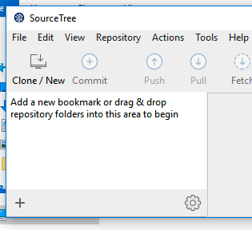
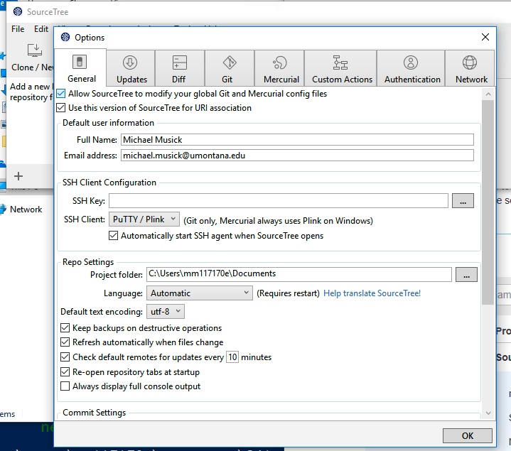
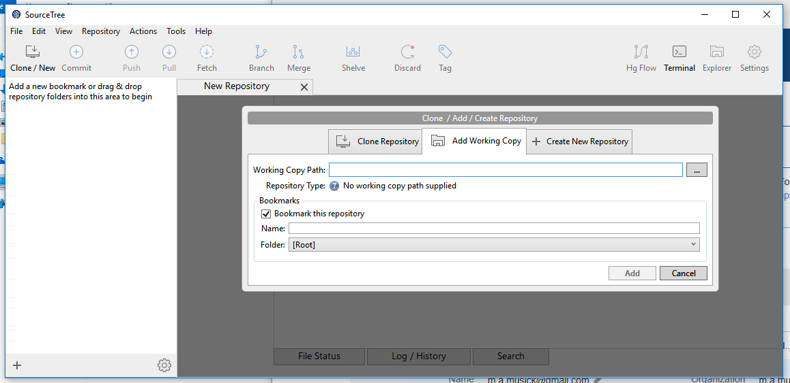
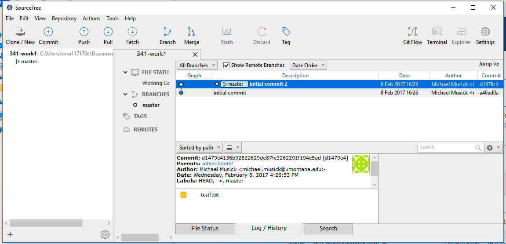
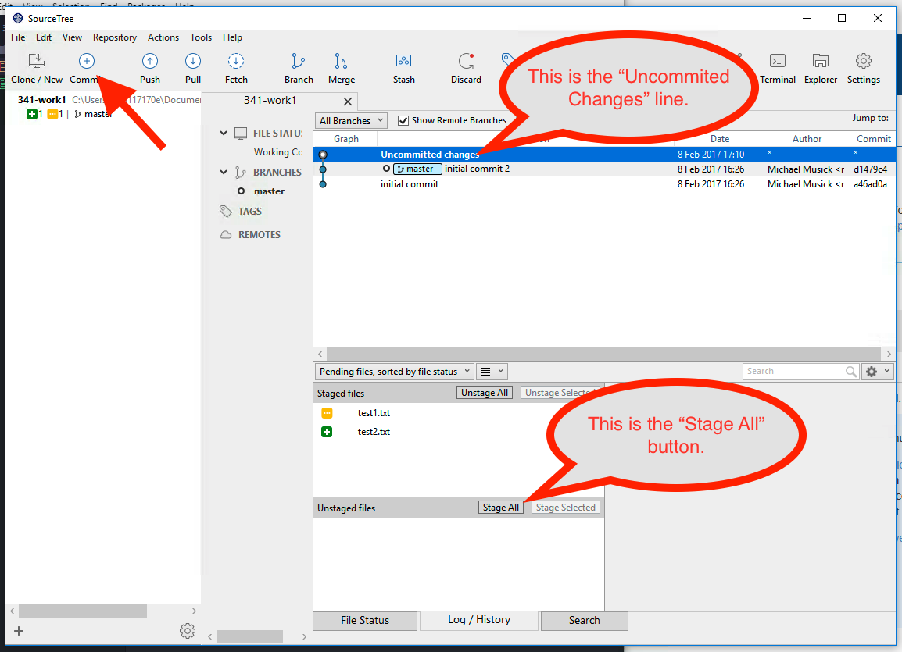

# Git GUI Applications - GitHub Desktop

Download the GitHub Desktop appliction from their site.
https://desktop.github.com

## on macOS

After downloading the application, simply drag it to your /Applications directory for macOS.

When you open the app for the first time, you will be guided through an additional setup process.

#### 1. Login to GitHub

First, click continue. Then, login to GitHub with your username & password.

#### 2. Configure Git

On the "Configure Git" screen, enter your name and email, if they are not already there.

You should also click the box that says "Install Command Line Tools".

Then click "continue" again.

#### 3. "Find Local Repositories"

GitHub will look for your local (i.e. the repo's on your computer) and make it easy for you to add them. You can do that now if they show up, or add them later. (Skip the add repo step below, if you add them now.)

#### 4. Add your Repo

To add a local repo, you need to click the "+" button in the upper-left hand corner of the application window.

Then click the "add" tab.

Finally, click "choose", and then navigate to the top level of your git repo we created earlier.

You can then click "Open" and when you return to the "add repo" window, click "Add Repository".

## on Windows

#### 1. Download & Run the Installer

After downloading the application, right click the application in the Downloads folder from the file explorer and select "run as administrator".

This will cause the installer to run and do its thing.

#### 2. Login

When presented with a "Log in" screen, log in to your GitHub.com account using your username and password. Then Select "Log in"

#### 3. Configure

Make sure your name and e-mail are entered correctly on the "Configure" screen. Then click "Continue".

#### 4. Repositories

GitHub Desktop will attempt to find and load repositories on your computer for you. If it found your repo, select it and click "Add Selected" below. (If you add your repo here, then skip the next "Add Local Repo" section on this page.)

#### 5. Add Local Repo

To add a repository in GitHub Desktop you will need to click the "+" button in the top left corner of the window.

Select the "Add" tab. Then Select "Browse"; this will open a browser, where you should navigate to the top level of your git repo. Select your folder, then hit "OK".

When you are brought back to the add box, click the "Add repository" button.

## Making Commits with GitHub Desktop app [all together now (macOS + PC)]

Since GitHub Desktop is nearly identical between mac and PC, I will only be including one set of instructions for this section. If you get confused, please email your instructor.

Let's now learn how to make commits of our file changes with GitHub Desktop. The first thing we should do is open our repo in Atom. Assuming Atom was able to perform a normal, full-permission install, you should be able to right click on the repo name in the "repository browser" area in the left of the applications window. Then you can click "Open in Atom".  This will open Atom, with the repository directory active.

Make a change to any file you want within your repo. Just make sure you save it from Atom.

Then move back to the GitHub Desktop App. You should now see that the center button says something like "1 Uncommitted Change".

Make sure this button is select by clicking it. It will turn dark-grey and display the "commit window". In here you can select/un-select files to group in a single commit. This is the equivelant of "staging" files in the terminal or Sourcetree.

When you select a file, it will show the differences since the last commit of that file on the right side of the window.

Where it says "Summary" is where you enter commit messages. You must enter a commit message with every commit, or the program will prevent you from saving your commit.

Below the commit message box is the button to actually create the commit.

#### { TODO: }

- Practice changing files, saving them, and making commits in GitHub Desktop Application.
- Click on both the "Uncommitted Changes" and the "History" buttons to explore the different types of information shown.
- In the History view, click on different commits to see what files changed and how.

On the first screen, select "I Agree", and unselect "Help improve...". Then click 'continue'.

You must agree to the “Atlassian Customer Agreement”, and it is your choice about whether you want to provide them with “usage data”.

You will then select to follow the “Go to My Atlassian” to create an account. This is necessary to register the app. After creating an account, go back to the Source Tree app and click the “Use an existing account” button. Then sign in.

Skip the “Connect an account” setup page for the time being.

### on PC

- After finishing the setup window, PC users will be asked to "Load SSH Key?". Select "NO".
- You will then see a window saying "Murcurial not found". Select "-> I don't want to use Mecurial".

### on macOS

You should then see the “Repository Browser” window, which will be empty for you. (If you do no see this window, go to the Window tab in SourceTree and select “Show Repository Browser”.)

Finally, open the SourceTree preferences (`cmd` + `,` _OR_ the gear icon on the right of the window). In there you should enter your name and e-mail (just as we did in the terminal). You should also change the default “Project folder:” path to look at your /Document directory.

### on PC

You should then see the “Repository Browser” area on the left of the open window.

Finally, open the SourceTree preferences (`control` + `,` _OR_ the gear icon on the bottom-right of the browser area). Make sure the "General" tab is selected. In there you should enter your name and e-mail (just as we did in the PowerShell). You should also change the default “Project folder:” path to look at your /Document directory.

## Add Our Existing Git Repo

### on macOS

Now that SourceTree is setup, lets add our existing Git Repo. To do this, select the “+ New Repository” tab in the SourceTree Repository Browser window. This will open a dropdown menu, from which you should select the “Add Existing Local Repository”.

This should open a “Finder” window, from which you need to navigate to the top level of your repository. Then select “Open”.

This should create a new Repo in your Repository Browser Window labeled the name of your repository directory (“341-work”).

To view the Repo, double click on it in the Repository Browser. This will open a repository window.

If it is not already selected, select “History” from the “WORKSPACE” sidebar on the left. This shows your “commit history” in the main WORKSPACE window.

### on PC

Now that SourceTree is setup, lets add our existing Git Repo. To do this, select the “+" button from the bottom-left corner of the sourcetree app. New Repository” tab in the SourceTree Repository Browser window. This will open a new window within sourcetree. You should select the “Add Working Copy”.

Select the three dots to the right of the "Working Copy Path". This should open an “Explorer” window, from which you need to navigate to the top level of your repository. Then click "Select Folder". Finally, click the "Add" button.

This should create a new Repo in your Repository Browser Window labeled the name of your repository directory (“341-work”).

You should also see the repo in the right two-thirds of the sourcetree window.

You should also be able to see your commit history in the main portion of the window. As is shown in the picture below.

### all together (macOS + PC)

In the WORKSPACE, you can see each commit that has been made, along with the “commit author” and date of the commit. If you click on a commit, it will show the files that were effected down below. Selecting a file shows the differences that occurred between commits.

In the top bar, you should see some familiar buttons. The “Commit” button is used to make commits. The “Show in Finder” and “Terminal” buttons can be used to open the repo in the Finder or Terminal ('Git-bash' on windows) respectively.

## Make a Commit
Go back to your text editor, and make some changes to the existing text file. You should also add a new file in the repository directory and place some random text within it.

After making these changes, come back to the repo window in SourceTree. There should now be a new entry in the history WORKSPACE with the description “**Uncommitted changes**” (it is hard to find at first. It is the line above your commit messages, and below the "description" header in the workspace). Select that line. You should then see All changed or “pending file changes” below. Notice that selecting a file shows the changes that you made.

For macOS, you will notice how the file that previously existed is pre-selected, whereas the new file you added is not. We want to add this new file as well as the changes made to our old files. So make sure every file is selected. This is how you “stage” files for commit in SourceTree on macOS.

For PC, you need to either select the specific files you want to stage and the click stage selected" or simply click "Stage All". This will move all of the files from the "Unstaged" area to the "Staged" area.

Once you have made sure all the files are selected, you should click the “Commit” button in the top-left corner of the window.

The window that comes up is how we make commit messages. In the text box under your name, you should add an appropriate commit message. Then hit the commit button in the lower-right corner of the window.

On macOS, you may be asked to “Confirm Add?” For the new file. Select the “Do not show this message again” box and click “OK”.

There should now be a new commit in your Repo window with the message that you just entered.

Again, selecting different commits will show the files changed for each one. Selecting those files will show how they changed from the last commit.

<iframe class="embed-responsive-item" src="https://www.youtube.com/embed/s0iPveZHsfA" frameborder="0" allowfullscreen></iframe>

## { TODO: }

Practice adding and changing files within your Git repo using the GUI Git app of your choice. Try to decide if you want to use an app or the terminal/command line.
