# GitHub.com

## Repository Hosting
[GitHub.com](https://github.com) is a web-based Git repository hosting service.

<iframe class="embed-responsive-item" src="https://www.youtube.com/embed/VUaBfYCmJls" frameborder="0" allowfullscreen></iframe>

GitHub allows users to have an unlimited number of *public* repositories under 2GB each. Meaning your source code is publicly available to the world for them to view and fork (copy). This is great, as it encourages “[open source](https://opensource.org/osd)” software projects. Open source software encourages the development of shared knowledge and progress within the open source community. It also means that all code is publicly viewable.

## Advanced Collaboration Tools
As you saw in the above video, GitHub also provides advanced collaboration tools. This is not something you will use much this semester. However, it is important to know about and you will use it in future projects.

## Static Website Hosting
GitHub also provides a service known as GitHub pages. This service provides free static website hosting. This is what you will primarily use this semester to host your web projects. (Did I mention it is free! This means you do not have to purchase server providers from another company.)

## Community Wiki Pages
Each repository also contains a community-editable wiki page, which can provide in depth information and how-to tutorials on a specific project.

## Issue Tracker
The Issues tracker serves as a place for people to create new “issue” or “feature requests”. This can then be used to assign people to work on these issues, ask for help from other users, or track the progress of a new feature.

# GitHub and This Course
This course, the one you are looking at right now, is being provided to you entirely through GitHub.

The website you are looking at now is hosted via GitHub pages.

Also, almost all of the resources for this course that you will need are available from a course repo. Eventually, I will show you how to “clone” the course repo to your own machine so that you can have easy access to these resources.

You will submit links to your homework assignments to the wiki page for the course repo. This will allow you to see each others work as well.

The wiki will also be somewhere that you can post resources

Finally, you will be expected to log “issues” which might be problems or questions. You will also be expected to respond to at least one issue every week.

# Getting Up & Running with GitHub

## Create an Account
First, visit [GitHub.com](https://github.com/) and create a new user account. (Step 1 should have been completed during week-01)

**NOTE:** Please choose a username that you are comfortable with being part of your publicly visible URL. Ideally, this should be your name or something similar. Your username will be publicly available and used often for many things throughout this course and your entire time on GitHub.

- Fix any problems the signup engine informs you about.
- On Step 2: Keep “Unlimited public repositories for free.” selected. Then select “Continue”.
- Finally, go to the mail account you used during account creation and verify your e-mail address.
- After your account is created, select the avatar in the upper-right hand corner. This should produce a dropdown menu. From there select the “Settings” option.

- From here feel free to fill in as much or little of the public profile information as you want. (Although filling in your name and Profile Pic is encouraged)

# Link GitHub to SourceTree
After creating a GitHub account, the next step is to link it to SourceTree (or the GitHub Desktop App).

Our repository does not exist on GitHub.com yet, instead, we only have a local copy of it, without any _remote_ version. This means we need to tell the destination remote server to create the repository, assign it a unique URL, and create space for the associated data.

**See Below if you are on a PC _OR_ have decided to use GitHub Desktop**

### on macOS

- In SourceTree, open preferences (`cmd` + `,`) and navigate to the “Authentication” tab.
- Click the “Add…” button.
- Under the “Host:” dropdown menu, select GitHub.
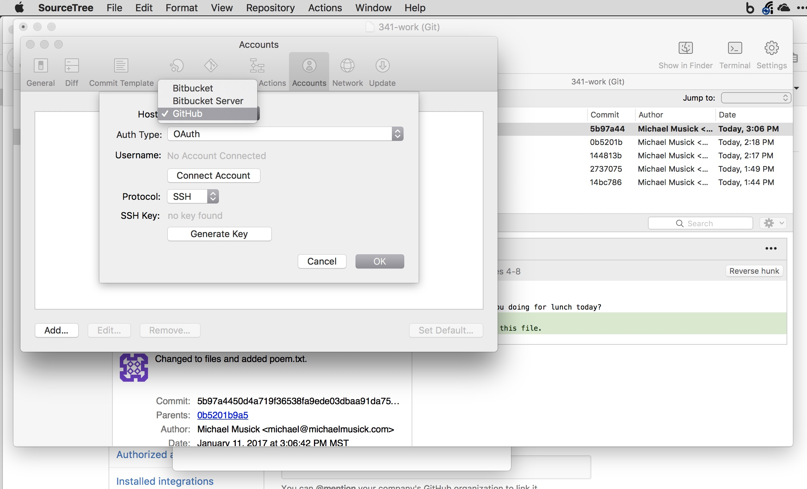
- Under “Username:” select the “Connect Account” button. Sign in to your GitHub account, using the credentials you just created.
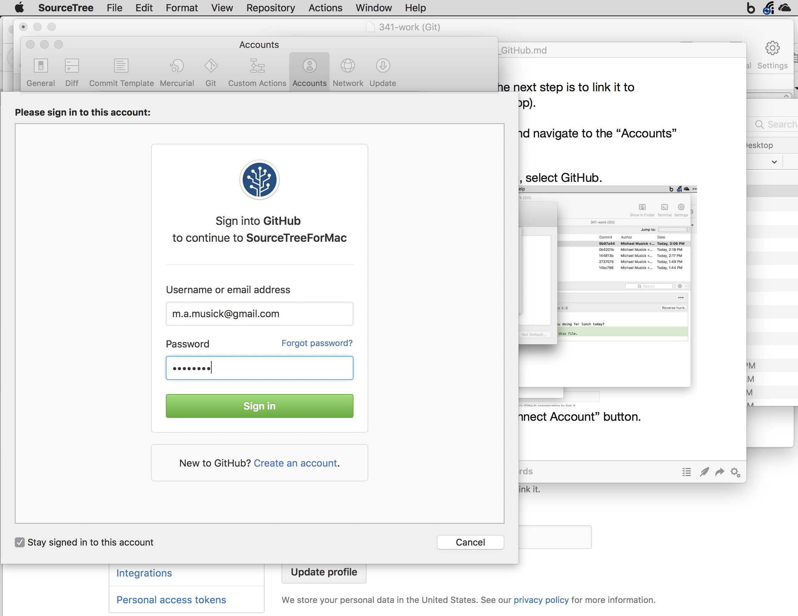
- You may then see another screen which you need to scroll down until you see a green “Authorize application” button, then click that button. (You may also skip this step depending on how GitHub views your computer)
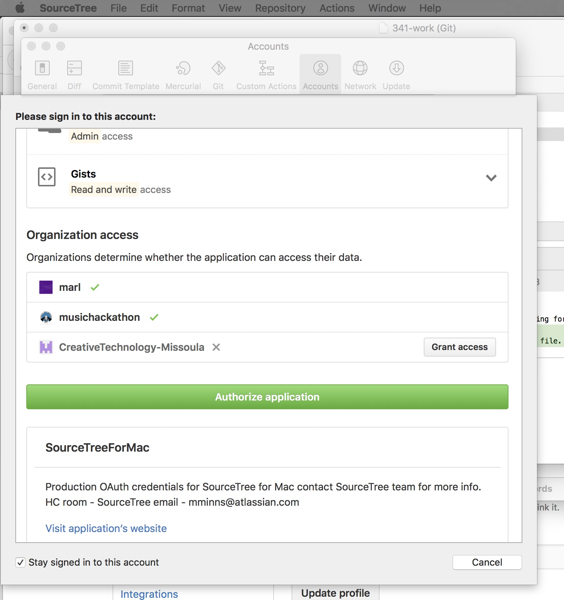
- Next, under “Protocol: “ change the dropdown menu from SSH to HTTPS.
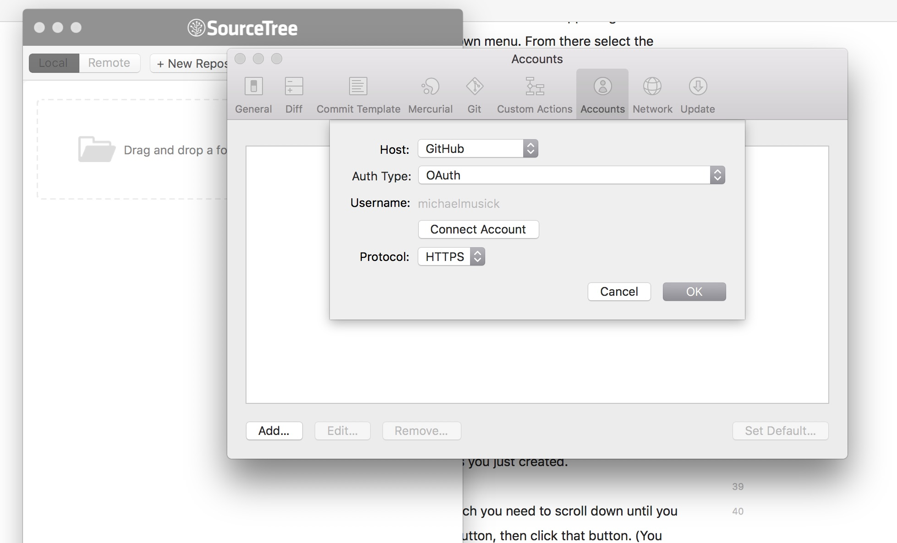
- Finally, click “OK”.
- You can now close preferences.

### on PC

- In SourceTree, open preferences (`control` + `,`) and navigate to the “Accounts” tab.
- Click the “Add…” button.
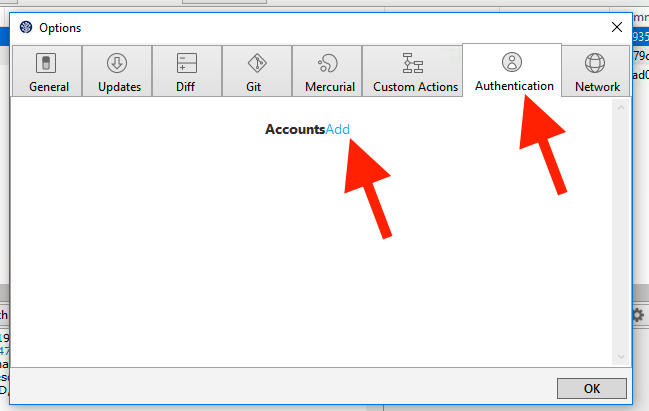
- Under the “Host Service:” dropdown menu, select GitHub.
- Under "Authentication:" change from 'OAuth' to 'Basic'.
- Then enter your github.com username in the "Username:" field.
- Make sure eerything else looks like it does in the following pic.
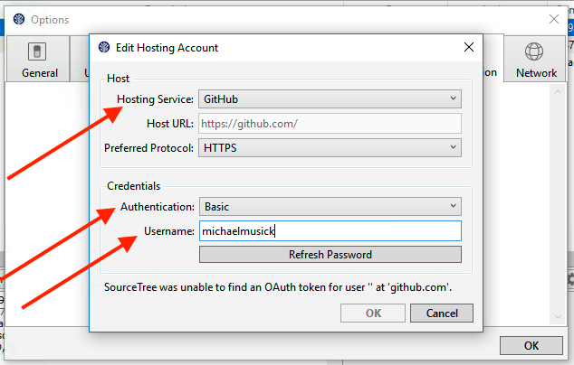
- Finally select the "Refresh Password" button. Enter the password you use for GitHub.com.
- Finally, click “OK”.
- You can now close preferences.

## Add the Git Repo to GitHub.com from Sourcetree
Finally, lets add our “341-work” Git repo to GitHub.com.

### on PC

- Go to GitHub.com and select the green "New Repository" button.
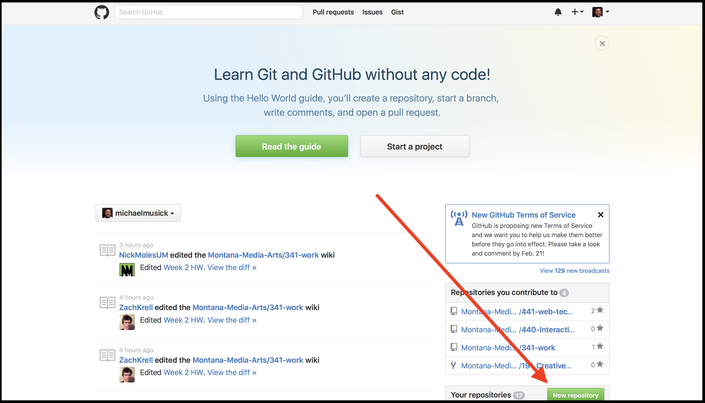
- Under _Repository Name_ enter "341-work".
- Enter a description for the repo
- Leave "public" selected.
- And finally select "Create repository"
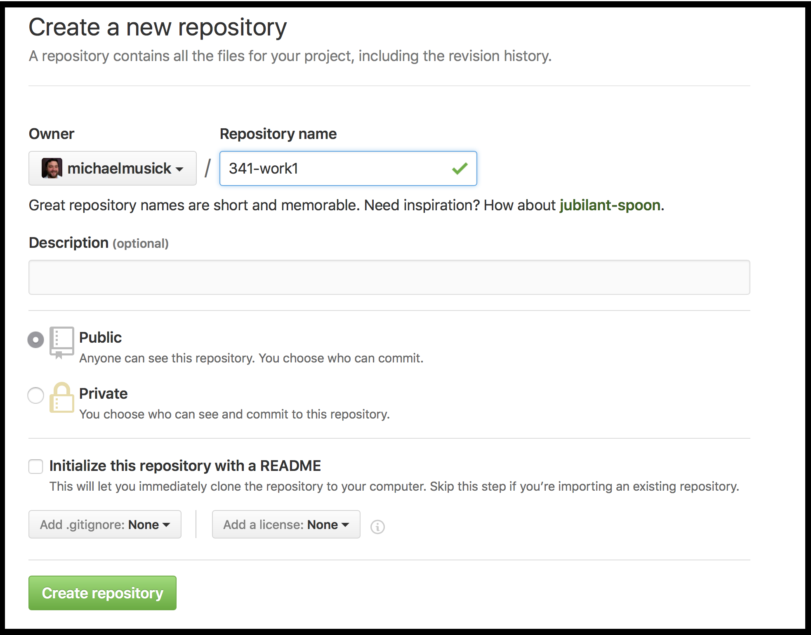
- This will bring you to your new repo in GitHub.com. At the top should be an HTTPS link. Select and copy this link (also ensure HTTPS is selected as opposed to SSH).
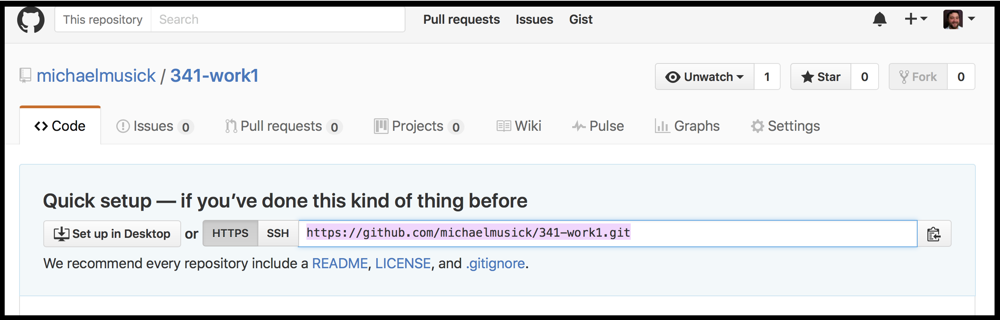

- Go back to the sourcetree application.
- Select the repo's "Settings" by clicking the gear-icon in the top-right corner of the sourcetree application.
- Ensure the "Remotes" tab is selected and then click the "Add" button.

- In the "Remote details" window the pops up, do the following;
    - To the right of "Remote name:" Click the "Default remote" box.
    - In the "URL/Path" text box, paste, the URL you copied from GitHub.com.
    - This should the rest to fill in. But in case it doesn't...
    - Ensure "Host Type:" is set to GitHub. And that "Username:" is filled in as your github username.
    - Finally click "OK".
    - Then click "OK" again in the "Repository Settings" box to confirm these changes.
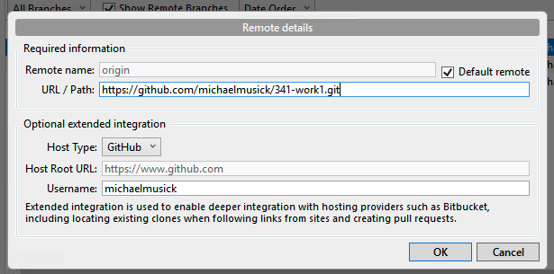

- Now, the time has come to sync and then push. To do this;
    - First select the "Pull" button near the top of the window.

- Now, the time has come to push our local data to the remote repository on GitHub.com. To do this;
    - Select the "Push" button near the top of the source tree window.
    - Then ensure the checkbox by "master" is selected.
    - Finally press "Push".
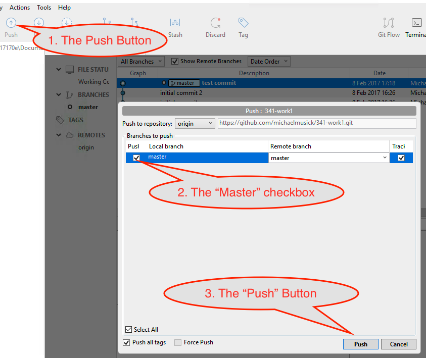

### on macOS

- Go to the Repository Browser window in the SourceTree app. (You can get to this from the “Window” tab in the menu bar.
- Right-click, two-finger-click, or control-click the 341-work repo to bring up the context menu.
- Select “Publish to Remote…”
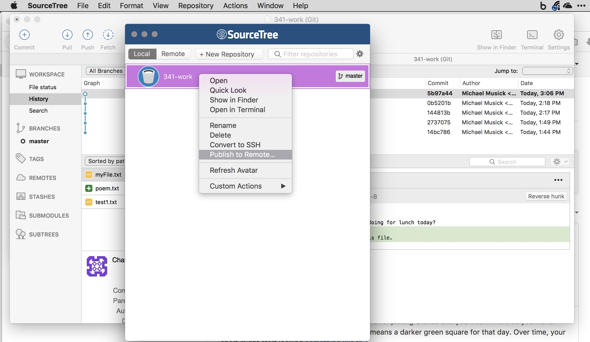
- Make sure the Account and Owner are you.
- Leave the name of the repo at 341-work
- Make sure type is “Git”
- UNCHECK, the “This is a private repository” box.
- Then click the “Create” button.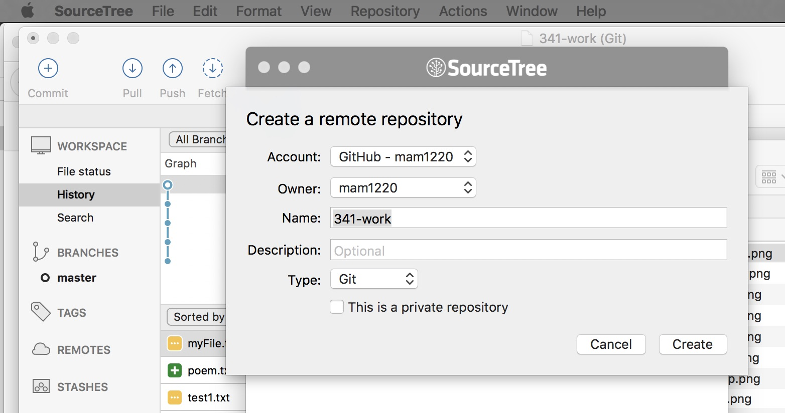
- After the repo is created remotely, you should see a window that starts with “Push to repository: “. This is how we sync data between a local git repo and a remote repo.
- Select the “master” branch check box.
- Then click “OK”
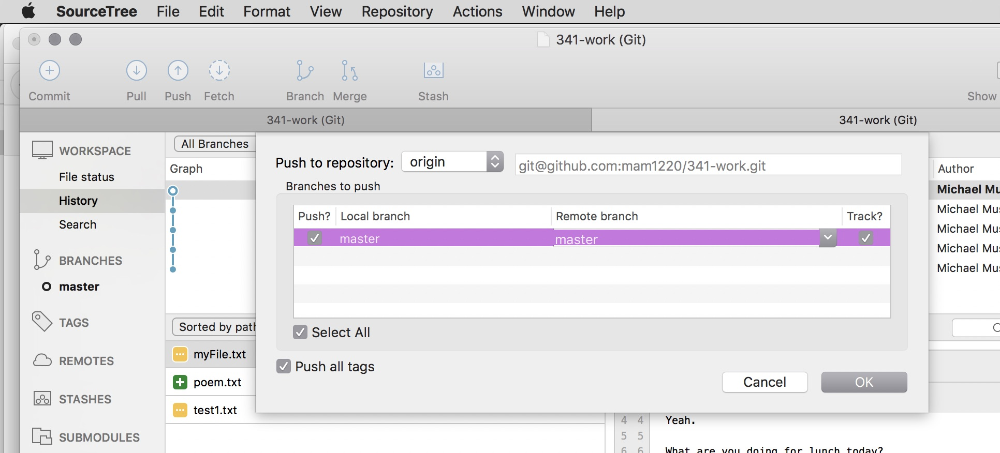

<!--
**NOTE: ** If you have “permission” problems do the following.

- Go to GitHub.com, and select the 341-work repository, which should have been created.

- Select and copy the HTTPS address for the repo (as opposed to the SSH address).
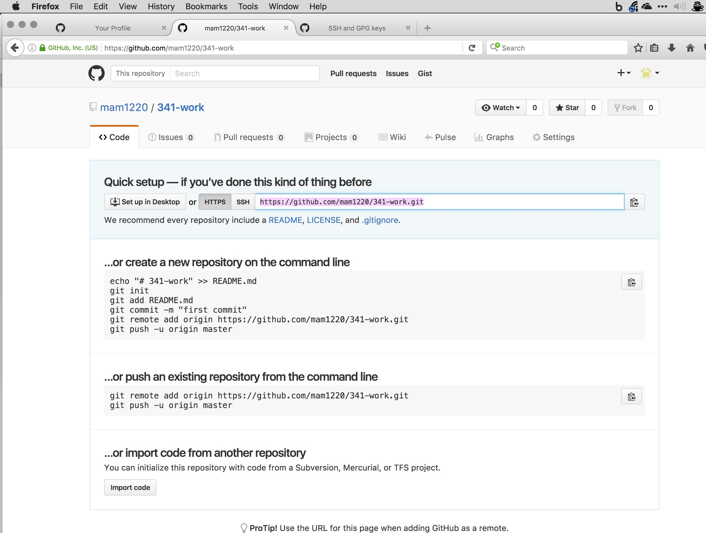
- From the repo window in SourceTree, select the “Settings” button in the top-right hand corner, and then select the “Remotes” tab.
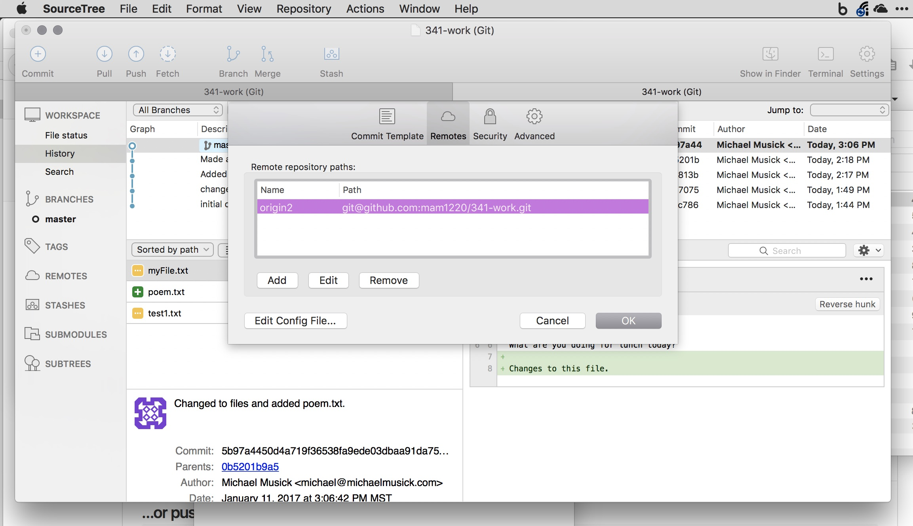
- Select the “origin” remote and click “Edit”.
- Replace the “URL / path:” address that starts with “git@github” with the “https” address you copied from GitHub.com. Then click “OK”.
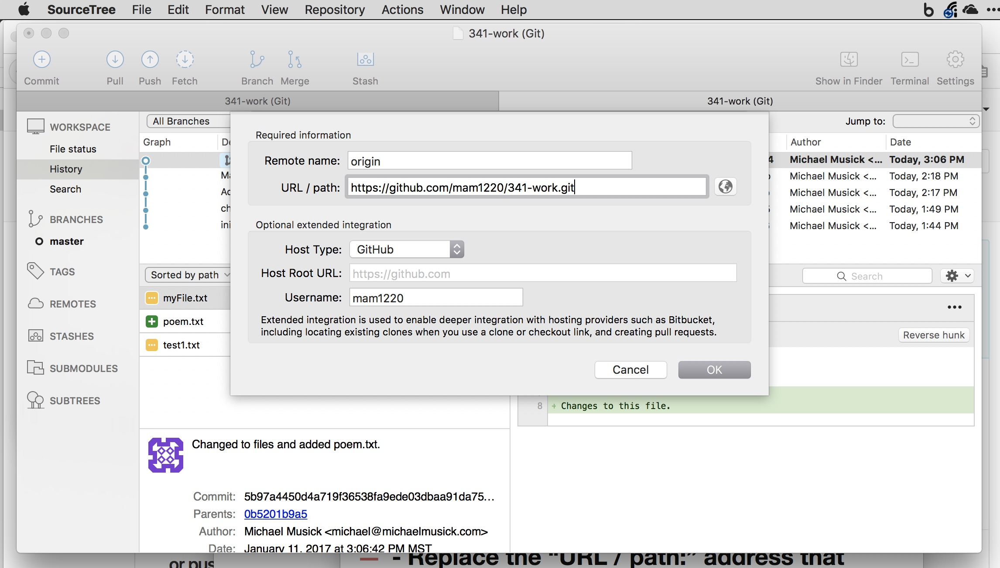
- Finally, hit the “Push” button from the top bar.
- Select the “master” checkbox. Then hit “OK”.
- You will be asked to enter your GitHub.com credentials. If you are on a Mac, I would save these in your keychain.
-->

# Link GitHub.com to GitHub Desktop

The process of linking GitHub Desktop to GitHub.com is a rather straight forward procedure.

From GitHub desktop this is done very easily by pressing the "Publish" button on the top-right of the application window.

When the publish window comes up, label the repository as you would like (probably, "341-work"), add a description, make sure your account is selected under "Account:" and press the "Publish Repository" button.
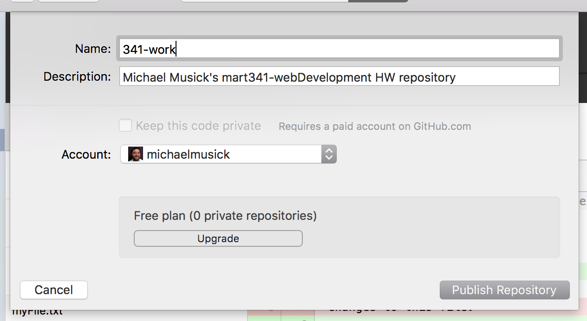

If you don't get an error message, you should be good to go. To check if all your files uploaded and the repo was created successfully, you should navigate to github.com. You can do this the normal way by opening your browser and simply typing in the site address, or you can right-click in the repo, from the repository browser on the left and select "View on GitHub".
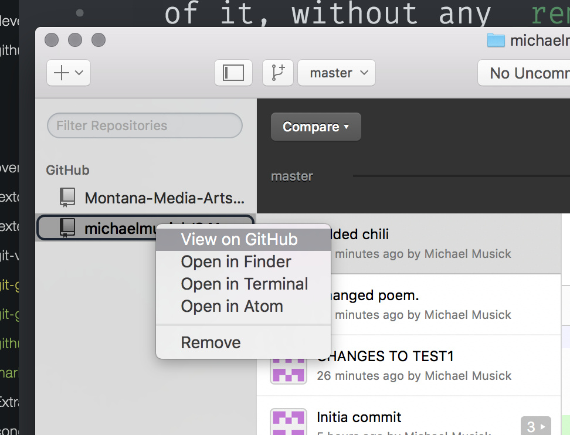

The button that used to say "Publish" should now say "Sync". Whenever you commit new changes to your Git repo via GitHub Desktop, you need to remember to press "Sync" when you are done working. This "pushes" you changes to the remotely hosted version of your repository on GitHub.com.

# Success Pushing
To verify success in pushing the repo, go to GitHub.com. You should see “341-work” under “Your repositories”.

Select your 341-work repository. You should see the files you added to your repo on the GitHub.com site.
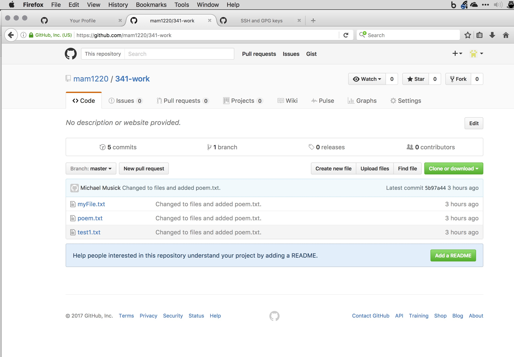

You can now select any of these files to view their contents.

Likewise, you can select the “commits” tab to see all of the commits you have made in your repo so far.
