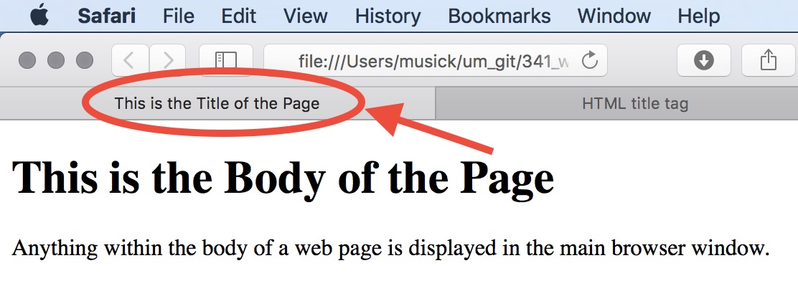

# Elements in the Head

There are a number of elements which we can consider as **required** in the head element, and others that you are _encouraged_ to include. These elements tell the browser and processor information about the HTML document, such as the title, author, and publication date.


## Title

The _title_ tag defines the title of a document. This action;

- defines a title in the browser toolbar
- provides a title for the page when it is added to favorites
- displays a title for the page in search-engine results

You cannot have more than one title element.
However, you _must_ have the title element for the document to validate as HTML. This is the only _required_ element in the head.

```html
<!DOCTYPE html>

<html>
    <head>
        <title>This is the Title of the Page</title>
    </head>
</html>
```




## Link
The _link_ element tells a browser about other resources that the page may need to load. Typically, these are the _CSS_ or "style sheets" which dictate how a page will appear in a browser.

We will not use this element for the first few weeks, but will rely upon it for the remainder of the semester after we start with CSS.

NOTE: this element only requires an opening tag, as all information for the element is contained as attributes within the opening tag. This is known as an "empty element".

```html
<link rel="stylesheet" href="mystyle.css">
```

## Style
The _style_ element allows for simple style definitions to be established in a single HTML page without having to link to external documents. This is another element we will not use for the first few weeks but will rely upon heavily after we start looking at CSS.

```html
<style>
    body {background-color: powderblue;}
    h1 {color: red;}
    p {color: blue;}
</style>
```

## Meta
The META element lives inside the head element and contains information about that webpage.
It is not visible to users but fulfills a number of purposes such as telling search engines about your page, who created it, and whether or not it is time sensitive.

The meta element is an empty element, like the link element above. The most common attributes are 'name' and 'content'. These attributes are often used together and specify the properties of the entire page. The value of the name attribute is the property you are setting, and the value of the content attribute is the value that you want to give to this property.

For example, on the second meta line below, the name attribute indicates an intention to specify a description for the page. The content attribute is where this description is actually specified.
The value of the name attribute can be anything you want it to be.

We will look at the Meta element more later. For the time being however, you should include the following meta elements in your pages;

- Description: This contains a description of the page. This description is commonly used by search engines to understand what the page is about. As such, it should be less than 155 characters.
- Author: This defines the author of the webpage.
- charset: Define the character set to use for page display. To display an HTML page correctly, a web browser must know which character set (character encoding) to use. UTF-8 (Unicode) covers almost all of the characters and symbols in the world. This includes the original ASCII standard that covers most of the character symbols you use.

```html
<!DOCTYPE html>
<html>
    <head>
        <!-- Define the character set used -->
        <meta charset="UTF-8">
        <!-- Provide a description of your page -->
        <meta name="description" content="Free Web tutorials">
        <!-- Provide the author information for the page -->
        <meta name="author" content="John Doe">
        <title>Meta Example</title>
    </head>
</html>
```

## Viewport
HTML5 introduced a method to let web designers take control over the viewport, through the <meta> tag.

The viewport is the user's visible area of a web page. It varies with the device, and will be smaller on a mobile phone than on a computer screen.

You should include the following <meta> viewport element in all your web pages:

```html
<meta name="viewport" content="width=device-width, initial-scale=1.0">
```

A <meta> viewport element gives the browser instructions on how to control the page's dimensions and scaling.

The width=device-width part sets the width of the page to follow the screen-width of the device (which will vary depending on the device).

The initial-scale=1.0 part sets the initial zoom level when the page is first loaded by the browser.

We will discuss this property more when Responsive Web Design is introduced. In the mean time, include this in your head elements so that your pages display more appropriately on mobile browsers.
