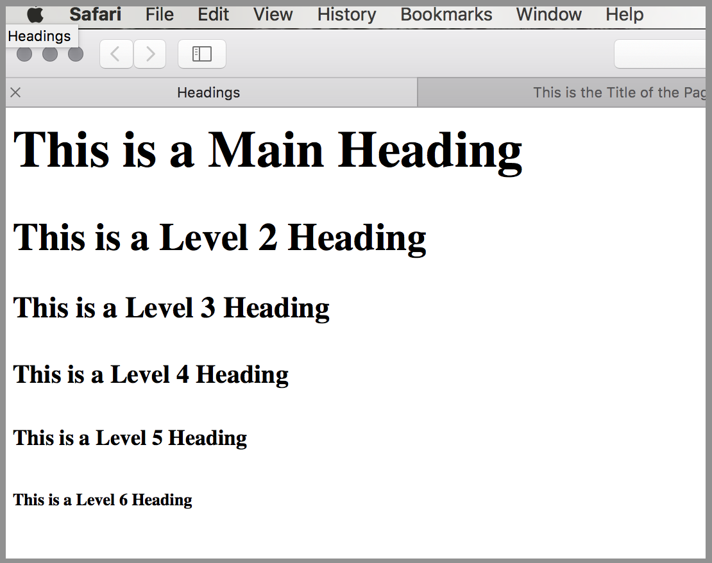
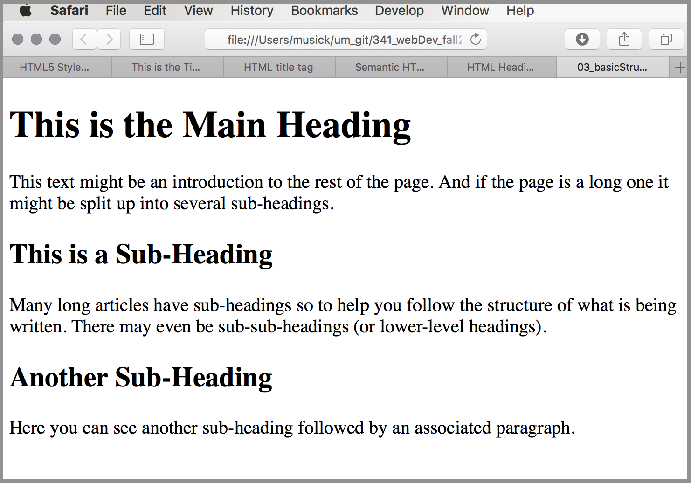

# Basic Structure
The most basic of structured documents should include tags identifying headings and paragraphs. These two markup elements are used in almost every document editing application and are crucial in authoring web content.

## Basic Paragraph
Any text between the paragraph tags `<p>...</p>` belongs to the same paragraph.

Almost all non-heading text will be placed within a paragraph element in a web document.

## Headings
Headings are defined with the `<h1>` to `<h6>` tags.

`<h1>` defines the most important heading. `<h6>` defines the least important heading.

`<h1` headings are considered to be _Main Headings_. While, `<h2>` headings are usually considered _sub-headings_ and so forth through `<h6>`.

By default, browsers will display headings with decreasing font size. Although, headings should instead be explicitly styled using CSS rules and definitions. This prevents any _un-expected_ rendering of the web document content.

```html
<!-- HTML Heading Code Example -->
<h1>This is a Main Heading</h1>
<h2>This is a Level 2 Heading</h2>
<h3>This is a Level 3 Heading</h3>
<h4>This is a Level 4 Heading</h4>
<h5>This is a Level 5 Heading</h5>
<h6>This is a Level 6 Heading</h6>
```


## A Structured Document
The following is an example of a structured document using main headings, sub headings, and paragraphs.

```html
<html>
    <body>
        <h1>This is the Main Heading</h1>
        <p>This text might be an introduction to the rest of the page. And if the page is a
             long one it might be split up into several sub-headings.<p>
        <h2>This is a Sub-Heading</h2>
        <p>Many long articles have sub-headings so to help you follow the structure of what
             is being written. There may even be sub-sub-headings (or lower-level headings).</p>
        <h2>Another Sub-Heading</h2>
        <p>Here you can see another sub-heading followed by an associated paragraph.</p>
    </body>
</html>
```
