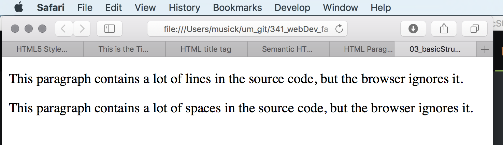
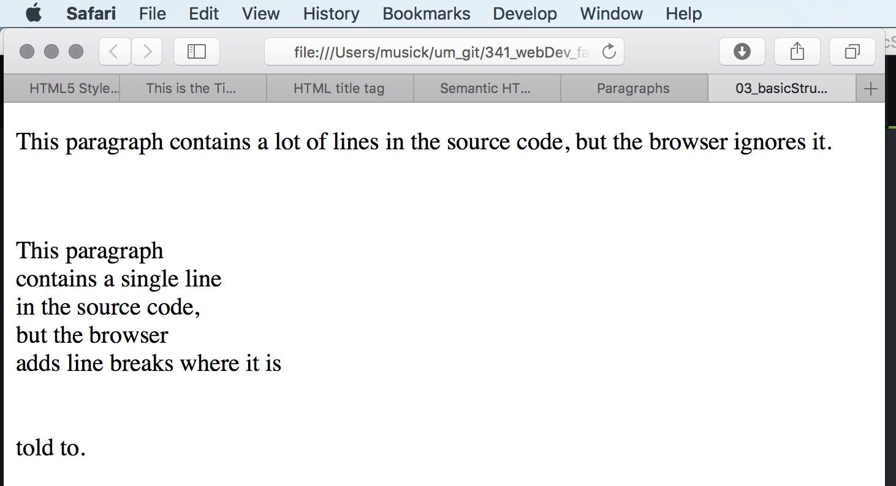
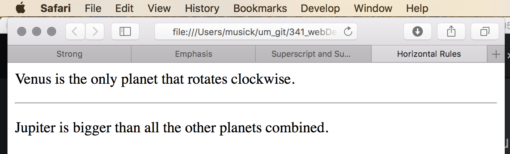

# More About Paragraphs

There are some things you should be aware of with paragraphs and browsers.

## Empty Space
By default, browsers will remove empty spaces from paragraph element blocks. This is true of spaces and extra empty lines. You need to be aware that you cannot change the output of your rendered HTML code by adding extra spaces or lines.

The following will both display as single line paragraphs after being rendered.



<p>
This paragraph
contains a lot of lines
in the source code,
but the browser
ignores it.
</p>

<p>
This paragraph
contains         a lot of spaces
in the source         code,
but the        browser
ignores it.
</p>





## Line Breaks
If you want to force a line break inside a paragraph, you can use the break tag. `<br />`


<html>
    <body>
        <p>
        This paragraph
        contains a lot of lines
        in the source code,
        but the browser
        ignores it.
        </p>

        <p>
        <br />
        <br />
        This paragraph<br />contains a single line<br />
        in the source code,<br />but the browser<br />
        adds line breaks where it is<br /><br /><br />told to.
        </p>
    </body>
</html>




## Horizontal Rules
A horizontal rule is a line that runs across the browser window. These can be used to visually differentiate content in a document.

Please note that line breaks `<br />` and horizontal rules `<hr />` are known as 'empty elements'. Remember, an ‘empty element' only has one tag. Before the closing bracket of an empty element there will often be a space and a forward slash character. It is a good habit to get into writing these tags in this way.

```html
<p>Venus is the only planet that rotates clockwise.</p>
<hr />
<p>Jupiter is bigger than all the other planets combined.</p>
```


## Pre-Formatted Text Element
You can use the pre element ( `<pre>...</pre>` ) to tell a browser to render spaces and text exactly as typed.

This tag usually displays the contents of the element in a fixed-width font, as it is primarily used for preformatted code. However, it can also be used for preformatted text.

This is one method that could be used to present a poem in a browser while maintaining appropriate formatting.

Look at how the four different approaches vary when rendered in Safari.



<html>
    <body>
        <h2>Single Paragraph</h2>
        <p>
          My Bonnie lies over the ocean.

          My Bonnie lies over the       sea.

          My Bonnie lies over the ocean.


          Oh,   bring back my Bonnie to me.
        </p>

        <h2>Multiple Paragraphs</h2>
        <p>My Bonnie lies over the ocean.</p>
        <p>My Bonnie lies over the      sea.</p>
        <p>My Bonnie lies over the ocean.</p>
        <p>Oh,  bring back my Bonnie to me.</p>

        <h2>Paragraph with breaks</h2>
        <p>
            My Bonnie lies over the ocean.<br>

            My Bonnie lies over the         sea.<br>

            My Bonnie lies over the ocean.<br>

            Oh,     bring back my Bonnie to me.<br>
        </p>

        <h2>Preformatted Text Element</h2>
        <pre>
          My Bonnie lies over the ocean.

          My Bonnie lies over the       sea.

          My Bonnie lies over the ocean.


          Oh,   bring back my Bonnie to me.
        </pre>
    </body>
</html>




### { TODO: }
Read pages 40-44 in chapter 2 of the Duckett.
