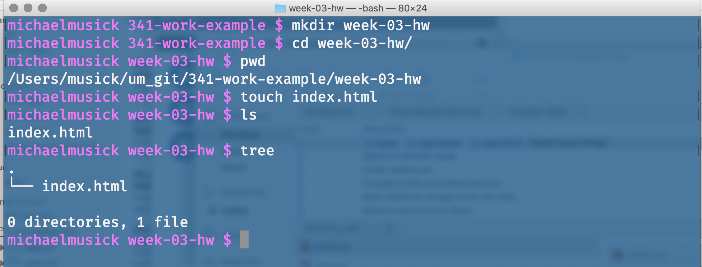
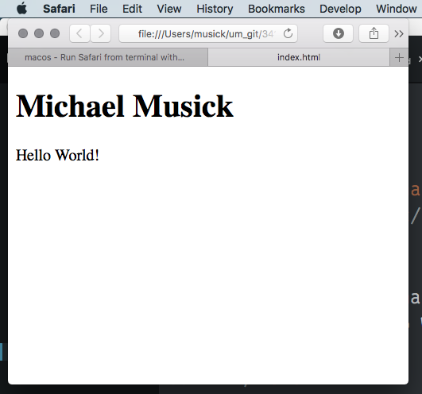
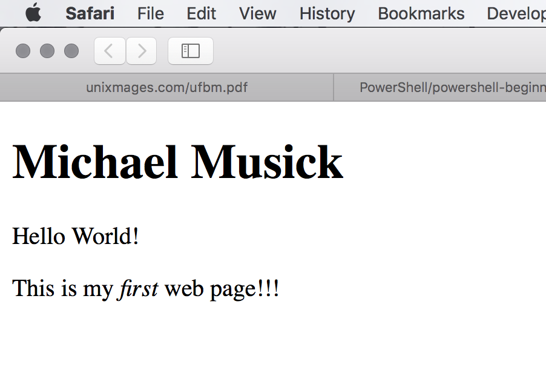

# Your First Web Page
Now that you know the basics of HTML it is time to write an HTML document and get it up on the web!

## 1: Create an HTML document
In your `/341-work` directory, create a new child directory labeled `/HW-Examples/week-03-hw`.

Within that directory create a new html document labeled `index.html`.


## 2: Open the file
Open the new file in your text editor. If you simply double-click the file, it will likely open in your default browser. Instead, you may need to drag it to the icon of your text editor app, or select “open file”

## 3: Create a Basic Document
Now that this blank index.html document is in front if you, we need to fill it.

### i. doctype declaration
Add the HTML5 doctype declaration on line 1.

```html
<!DOCTYPE html>
```

### ii.  Fill in the Basic Structure
Add the basic structure elements (`<html>`, `<head>`, & `<body>`), starting in line 2. Also include the uff-8 charset declaration and title elements in the head.

``` html
<!DOCTYPE html>
<html>
    <head>
        <meta charset="utf-8">
        <title></title>
    </head>
    <body>

    </body>
</html>
```

### iii. Add a Page Title
Now you can start adding information to your page. First, you should add a title for the page. For the time being, make that “My First Web Page” and add that between the title element tags on line 5.

``` html
<!DOCTYPE html>
<html>
    <head>
        <meta charset="utf-8">
        <title>My First Web Page</title>
    </head>
    <body>

    </body>
</html>
```

### iv. Add Some Content!
Finally, add a h1 element and 2 p elements. Populate these elements with your name, and the statement “Hello World!”, respectively.

``` html
<!DOCTYPE html>
<html>
    <head>
        <meta charset="utf-8">
        <title></title>
    </head>
    <body>
        <h1>Michael Musick</h1>
        <p>Hello World!</p>
    </body>
</html>
```

### v. Open the File in a Browser
OK, time to view your first webpage! You have a view options to open this file;

1. Double click the `index.html` file, as it should open in your default web-browser.
2. From terminal type `open index.html` (This should accomplish the same as above).
3. Drag the file to the browser you want it to open in.
4. Install the "open-in-browser" package for Atom and then either press cntrl + opt + q (mac) or from the command palate type "Open in Browser".

You should now see your file open in a web browser, looking something like this.


### vi. Make Some Changes
Back in your index.html document, add a new line at 10. There you should add a new paragraph element that includes the following text;

``` html
<p>This is my <em>first</em> web page!!!</p>
```


Your code should look like the following;

``` html
<!DOCTYPE html>
<html>
    <head>
        <meta charset="utf-8">
        <title></title>
    </head>
    <body>
        <h1>Michael Musick</h1>
        <p>Hello World!</p>
        <p>This is my <em>first</em> web page!!!</p>
    </body>
</html>
```

### vii. Refresh the Page
Next, navigate back to your browser and refresh your web page (cmd + r [macOS], cntrl + r [windows]). You should see the updated in your code reflected in the browser.

