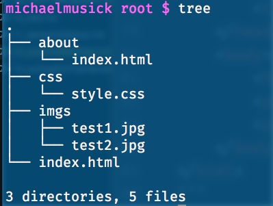

# About the `index.html` File
You are going to create a lot of files labeled `index.html`. When a URL is passed to a browser that does not specify a file, the browser automatically requests `index.html` from the host server. Essentially, this means something like `http://baseurl.com` and `http://baseurl.com/index.html` are the same. (This is not true for all websites, but for many.)

## File vs Directory based URLs
This assumption allows for the publication of "clean URL’s", as we do not need to explicitly include the `index.html` at the end of the URL. This is not to say that we could not have additional pages that we explicitly address. For example we could have additional html pages at the same directory level, such as an `about.html`. In which case the URL would look like `baseurl.com/about.html`. Our directory would look like the following in this case.

However, if you wished to have a “cleaner” looking URL, you could create an additional child directory labeled `/about` and place an `index.html` within that directory. The URL for this case would look like `baseurl.com/about/`. Notice how we do not use the `.html` and instead the URL ends with a directory slash. Our directory would look like the following in this case.

## Why is this important?
This discussion was had so that you could understand why I had you label your file as `index.html`. Eventually, this means your file will live at a URL that looks something like `baseurl.github.io/341-work/week-03-hw/`.

## { TODO: }
Please read the following from the Mozilla Developer Network on [Dealing with Files](https://developer.mozilla.org/en-US/docs/Learn/Getting_started_with_the_web/Dealing_with_files) to understand more about this topic.
