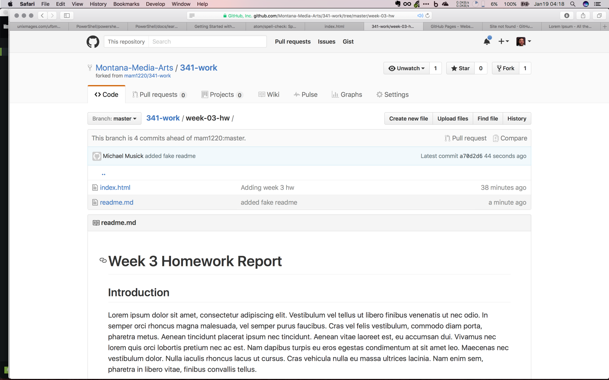

# Conclusions
We covered a lot of ground this week, introducing a a brand new language, as well as discussing how to take an `index.html` page and make it live on the Internet.

## { TODO: }

### Issue Discussions
If you are having problems, have questions, or would like to discuss this weeks work with your classmates, please open or respond to an issue in the class repo. As a reminder, you are expected to be active in the “issues” discussion section every week.

### Add to `index.html`
After successfully getting your site on the Internet, you need to practice your HTML that you learned this week. To that end, you are required to add content to your `/week-03-hw/index.html` file.

#### Poem
Following the content that is already there, I want you to add a poem. You are free to write your own poem, or copy someone else’s. This poem should be proceeded with a horizontal line ( `<hr />` ), then a heading (`h1`) that contains its title as well as a sub-heading ( `h2` ) that lists the author (ex. `by Glenn Postdamn`). Following these headings, your poem should be placed on the page using paragraph elements and potentially line break elements.

### `readme.md`
Just like last week, you are expected to write a well-formed readme.md file that is a technical report about your work this week. Remember to use markdown syntax to style and add structure to your document. This file should include information about what it is you did and learned this week, as well as information about trials/triumphs, additional sources your sought out, and how this week will change your work going forward.

This file is to be placed inside your `/week-03-hw` directory.

### Homework submission
To submit your homework you will add your name and two links to the [class repo wiki week-03-hw page](https://github.com/Montana-Media-Arts/341-work/wiki/week-03-hw). Under your sections “Submissions” heading you should add a new line with your name. Then a link whose text reads, “webpage”, this will link to your `index.html` page. Simply copy the URL from the browser and paste it here. Finally, you should include one more link with the text “Week 3 Directory”. This should provide a direct link to your /week-03-hw repo directory. To get this link, open up your repo in a browser, and navigate to the /week-03-hw directory. Assuming you have uploaded everything correctly, you should see your readme.md being rendered below the directory file list, which should include the `index.html` and `readme.md`. If so, simply copy the URL from the browser window.



Your final submission line in the homework wiki will look something like:

```markdown
# SUBMISSIONS
## Section 50 (Moles)
- Michael Musick: [webpage](https://montana-media-arts.github.io/341-work/HW-Examples/week-03-hw/) - [Week 3 Directory](https://github.com/Montana-Media-Arts/341-work/tree/master/HW-Examples/week-03-hw)
```
