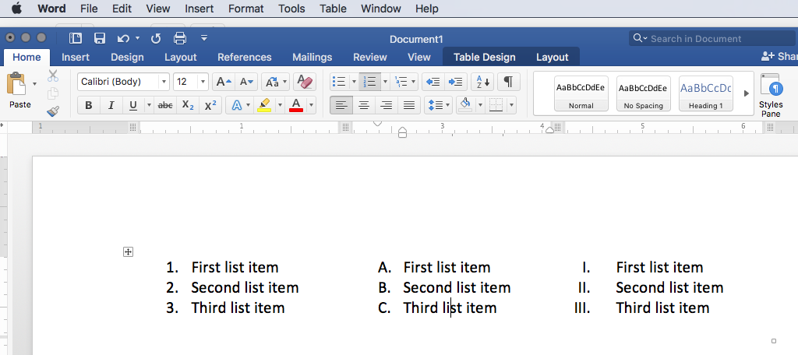
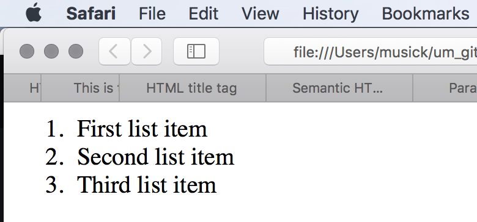
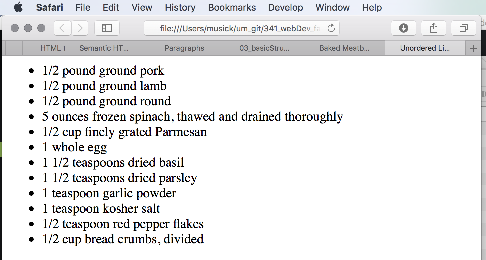
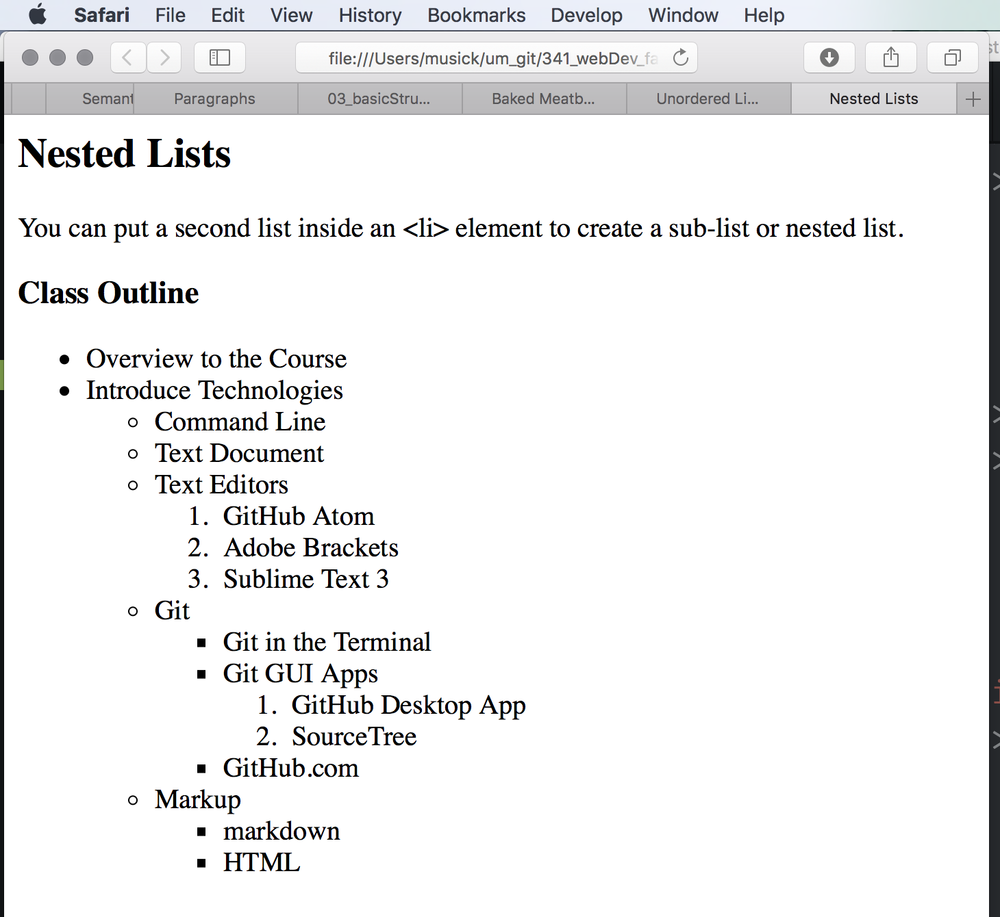
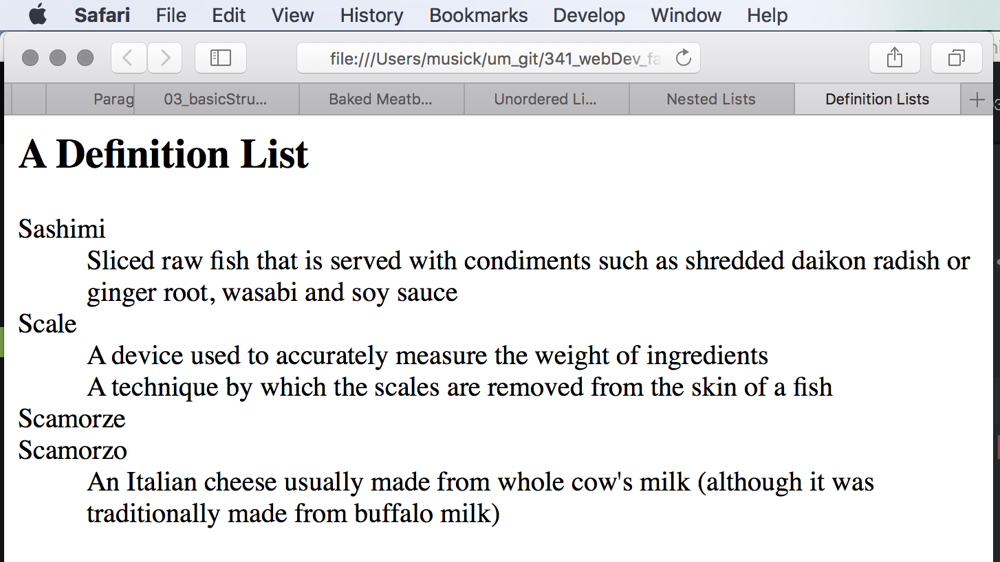

# Lists in HTML
Lists are a typical part of structured documents. Lists can be used to convey information like; sets of instructions, elements in a set, definitions, and outlines.

There are two major types of lists that are often used;

1. Ordered lists
2. Unordered lists.

## Ordered Lists
Ordered lists are those where each entry is prepend with an ascending identifier; such as numbers, letters, or roman numerals.


To identify a list, the content must be surrounded by the ordered list tags. ( `<ol>...</ol>` )

Each “list item” must be surrounded by the list item tags. ( `<li>...</li>` ).

```html
<ol>
    <li>First list item</li>
    <li>Second list item</li>
    <li>Third list item</li>
</ol>
```


## Unordered Lists
Unordered lists are those that which begin with dots, bullets, dashes, or other visual signifiers. These lists are great for things like ingredients in a recipe.

Unordered lists, by default, get a dot in most browsers.

To identify an unordered list, the content is contained within the unordered list tags. ( `<ul>...</ul>` ).

As with the ordered list, each list item is contained within a list item element. ( `<li>...</li>` )

```html
<ul>
    <li>1/2 pound ground pork</li>
    <li>1/2 pound ground lamb</li>
    <li>1/2 pound ground round</li>
    <li>5 ounces frozen spinach, thawed and drained thoroughly</li>
    <li>1/2 cup finely grated Parmesan</li>
    <li>1 whole egg</li>
    <li>1 1/2 teaspoons dried basil</li>
    <li>1 1/2 teaspoons dried parsley</li>
    <li>1 teaspoon garlic powder</li>
    <li>1 teaspoon kosher salt</li>
    <li>1/2 teaspoon red pepper flakes</li>
    <li>1/2 cup bread crumbs, divided</li>
</ul>
```


## Nested Lists
You can combine list types as well as use multiple nested list elements to create hierarchically related lists. This is particularly useful for outlines or multi-part recipes, as examples.

NOTE: Notice how the nested list is contained _within_ the parent "list-item" element.

```html
<h3>Class Outline</h3>
<ul>
    <li>Overview to the Course</li>
    <li>Introduce Technologies
        <ul>
            <li>Command Line</li>
            <li>Text Document</li>
            <li>Text Editors
                <ol>
                    <li>GitHub Atom</li>
                    <li>Adobe Brackets</li>
                    <li>Sublime Text 3</li>
                </ol>
            </li>
            <li>Git
                <ul>
                    <li>Git in the Terminal</li>
                    <li>Git GUI Apps
                        <ol>
                            <li>GitHub Desktop App</li>
                            <li>SourceTree</li>
                        </ol>
                    </li>
                    <li>GitHub.com</li>
                </ul>
            </li>
            <li>Markup
                <ul>
                    <li>markdown</li>
                    <li>HTML</li>
                </ul>
            </li>
        </ul>
    </li>
</ul>
```


## Definition Lists
Definition lists are used to define terms.

A definition list is identified with `<dl>...</dl>` tags.

The term being defined is encapsulated in "definition term" tags. (`<dt>...</dt>`)

The terms definition is then encapsulated in the "definition" tags. (`<dd>...</dd>`)

NOTE: Sometime you might see a list where there are two terms used for the same definition or two different definitions for the same term. This is acceptable.

```html
<h2>A Definition List</h2>
<dl>
    <dt>Sashimi</dt>
    <dd>Sliced raw fish that is served with condiments such as shredded daikon radish or ginger root, wasabi and soy sauce</dd>
    <dt>Scale</dt>
    <dd>A device used to accurately measure the weight of ingredients</dd>
    <dd>A technique by which the scales are removed from the skin of a fish</dd>
    <dt>Scamorze</dt>
    <dt>Scamorzo</dt>
    <dd>An Italian cheese usually made from whole cow's milk (although it was traditionally made from buffalo milk)</dd>
</dl>
```


# { TODO: }
Read chapter 3 from the Duckett.
