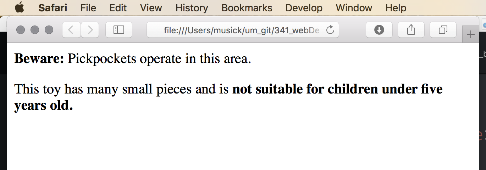
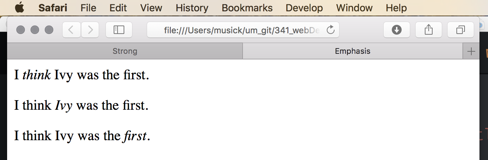
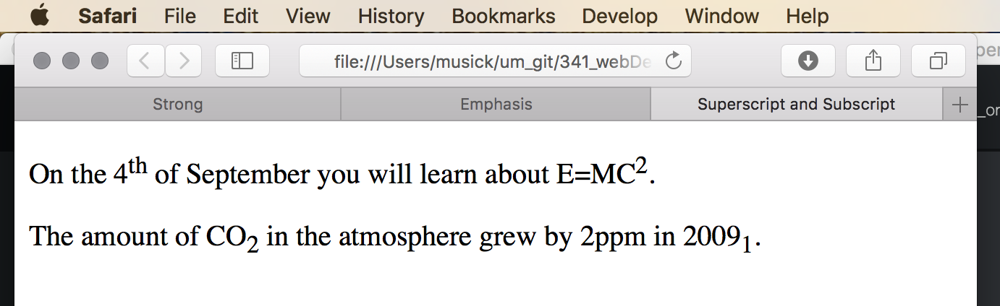

# Semantic Markup
As discussed earlier, semantic markup changes the meaning and emphasis of written text. Just as with the structural markup elements just presented, semantic elements are included directly in the text document and are signified by tags that surround the text they apply to.

## Bold & Strong
One of the most common types of semantic markup is to **“bold”** some text. The element used for identifying bold text is `<b>...</b>`.

However, it is important to recognize that the use of **bold** text does not imply any extra meaning. For this reason, you are encouraged to use the **strong** element.

The use of a **strong** ( `<strong>...</strong>` ) element indicates that its content has strong importance. By default, browsers will show the contents of strong elements in bold.

```html
<p><strong>Beware:</strong> Pickpockets operate in this area.</p>
<p>This toy has many small pieces and is <strong>not suitable for children under five years old.</strong></p>
```


## Italic & Emphasis
Just like bold, another very common semantic alteration is the use of _italicized text_. Text can be marked up as italicized with the use of `<i>...</i>`.

As with bold/strong, italicized text does not necessarily imply semantically different meaning. Instead, you are encouraged to use the _”emphasis”_ element instead ( `<em>...</em>` ). The _emphasis_ element indicates subtle changes in the meaning of a sentence. By default the browser will show these elements in italic.

```html
<p>I <em>think</em> Ivy was the first.</p>
<p>I think <em>Ivy</em> was the first.</p>
<p>I think Ivy was the <em>first</em>.</p>
```


## Superscript & Subscript
The superscript ( `<sup>...</sup>` ) & subscript ( `<sub>...</sub>` ) elements are used to raise or lower text relative to normal text.

The superscript element is used to denote characters that should appear as 'superscript'; such as date suffixes or mathematical powers.

The subscript element is commonly used with footnotes or in mathematical and chemical formulas.

```html
<p>On the 4<sup>th</sup> of September you will learn about E=MC<sup>2</sup>.</p>
<p>The amount of CO<sub>2</sub> in the atmosphere grew by 2ppm in 2009<sub>1</sub>.</p>
```


# { TODO: }
Read chapter 2 from the Duckett. Please pay particular attention to the remaining semantic markup elements presented there that we are not discussing here. These include;

- <q>block quotations & quotations</q> ( `<blockquote cite="">...</blockquote>`, `<q>...</q>` )
- <abbr title="Abbreviations and Acronyms take up toooooooo much space">Abbreviations & Acronyms</abbr> ( `<abbr title="">...</abbr>` )
- <cite>Citations</cite> ( `<cite>...</cite>` )
- <dfn>Definitions</dfn> ( `<dfn>...</dfn>` )
- Address ( `<address>... </address>` )
- <ins>Insert</ins> & <del>Delete</del> ( `<del>...</del> <ins>...</ins>` )
- <s>Strike-through</s> ( `<s>...</s>` )

You are responsible for all of these. 