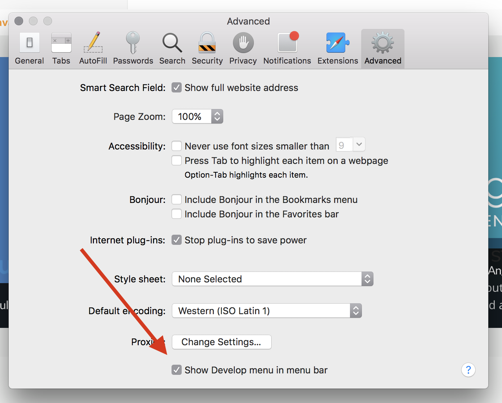
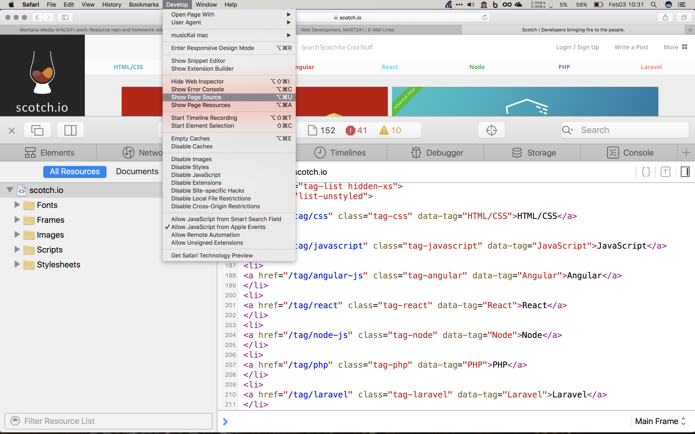
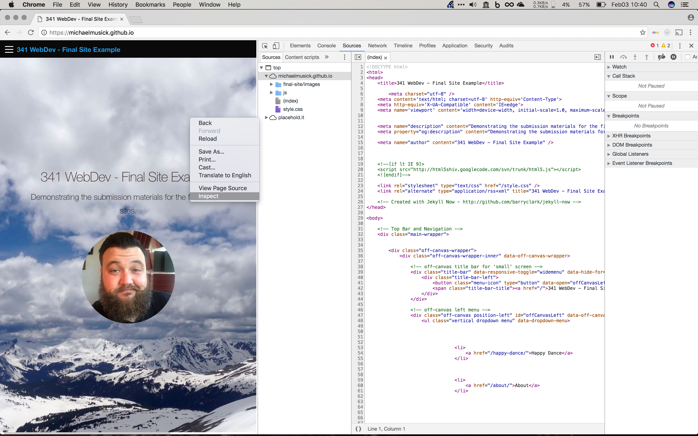
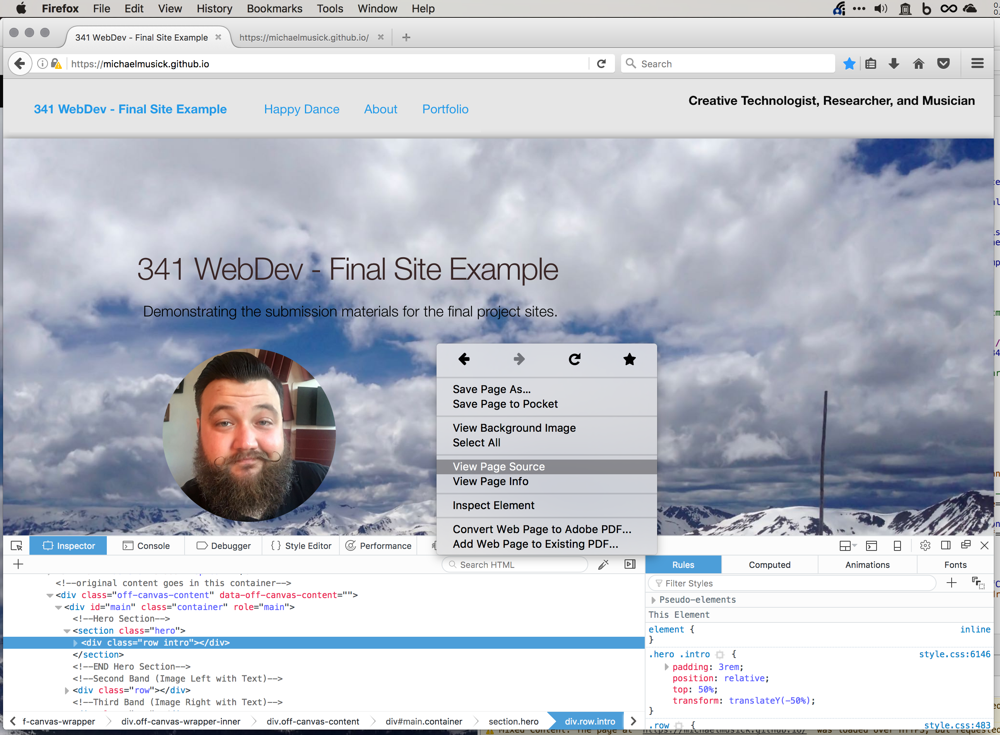
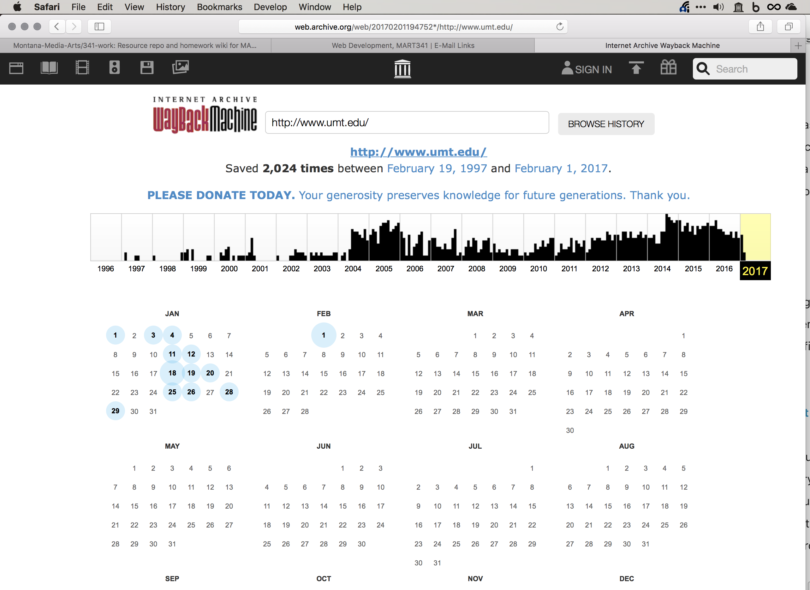
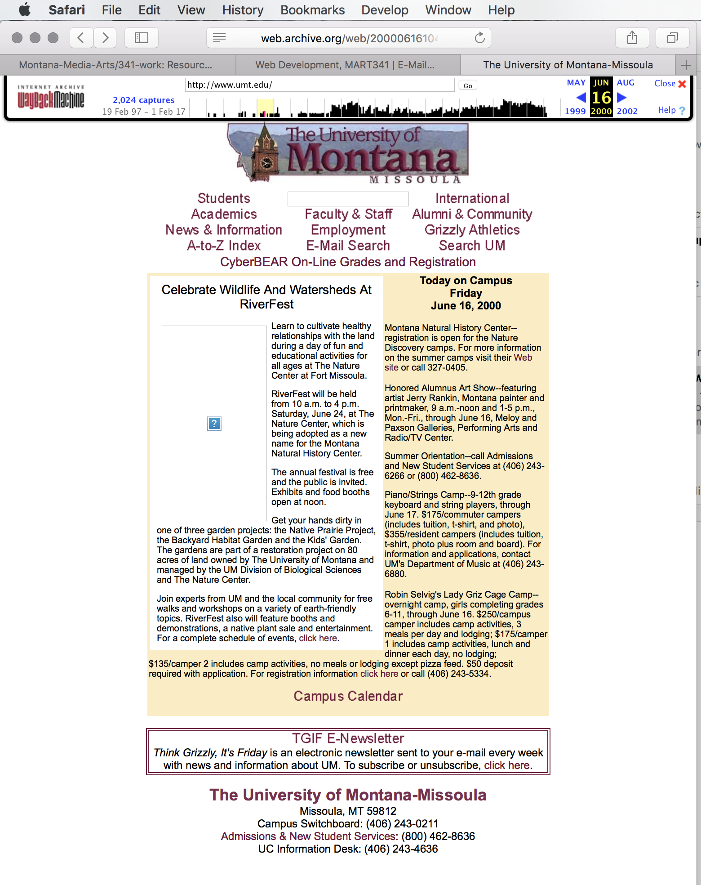

# Resources, Snooping, & History

There is too much information for any one person to know right away in development and coding. Luckily though, developers tend to be a helpful group with many resources to assist those getting started, and a community that is willing to answer questions about problems.

If you have been using the issues tab on the GitHub repo for this course, you will already recognize the importance of having a strong community to ask questions within.

There are a number of additional resources that you should start to take advantage of, in addition to your classmates and instructors.

# Snooping on Others Source Code

One invaluable resource for web developers is the ability to look at the code for websites you visit. Browsers get code from servers, which means you can look at this code to try and inspect how someone else might have solved a problem.

### Inspecting code in Safari

To inspect code in Safari, you first need to make it so you can see the developer tools. To do this;

1. open preferences (`cmd` + `,`),
2. go to the advanced tab,
3. then select “Show Develop menu in menu bar”. 

This will cause a tab to appear in your menu bar. You can now select this menu tab, then select “Show Page Source”. 

This will bring up a separate window/tab where you can navigate around all of the resources sent over to your browser for the specific web page.

You can also select the “Elements” tab from within this window. This alternative view of the code allows you to see where each html element is in the displayed page. As you move your mouse through the code, various parts of the page will highlight, representing the current element in the code you are inspecting.

### Chrome

In Chrome, if you right click, you can select “inspect” which will bring up the Chrome developer tools to the right.

You can use the “Elements” tab, to see source code, as well as the matching highlighted element in the actual page (as described above in Safari). You can also select the “Source” tab to see the raw course code files. Again, these allow you to see the code that creates the page your are viewing.  

### Firefox

You can do the same thing in Firefox as Chrome and Safari. Simply right click in the page you want to see the code for, and select either “View Page Source”, which loads the file in a separate tab, or “Inspect Element”, which open up a more complete set  of developer tools. 

## { TODO: }

Using a web browser of your choosing, please inspect the source code for a website you find particularly interesting. Remember, the main code most likely exists in the `index.html` file.

# The way Back Machine and Internet of Yesteryear

The final tool we will look at allows you to see what certain websites looked like at different points in history. This may not be the best resource for learning how to code a website, but it does allow you to get a sense for how a company may have viewed their brand over time, how the web used to look, or retrieve information from the past that is no longer live.

The resource is the Internet Archives [Wayback Machine](https://archive.org).

For example, [lets look at the history of `www.umt.edu`](http://web.archive.org/web/20170201194752*/http://www.umt.edu/). At the moment I took this picture, the page tells us, there have been 2024 snap shots taken of this site since the Internet archive began. Dating from Feb. 19, 1997 to Feb. 1, 2017.

I am going to select the year 2000, and the date June 16th, 2000. 

That shows us what the [University of Montana’s main site looked like at that moment in history](http://web.archive.org/web/20000616104233/http://www.umt.edu/). Definitely has a retro feel now, especially with that logo graphic. 

Some other great examples include;

- [whitehouse.gov from Oct. 23, 1997](https://web-beta.archive.org/web/19971023010656/whitehouse.gov)
- [The New York Times from Nov. 21, 1996](http://web.archive.org/web/19961121230155/http://www.nytimes.com/)
- [mtv.com](http://web.archive.org/web/19961222031059/http://www.mtv.com/)

## { TODO: }

Explore two sites and how they have evolved over their history on the web. One of these sites needs to have a pre-2000 presence, while the other one should be an contemporary artist you admire today.

You will be expected to write about this experience in your weekly report.

Also, please read pg.’s 35-36 from the Duckett.

# stackoverflow.com

[stackoverflow.com](http://stackoverflow.com) is a community forum for developers to search for solutions to problems. With where you are as students, almost any problem you  are having has likely already been had by someone else. There is a search bar in the top right of their site, use this to look for similar problems and the answers the community came up with.

This is a great place to start when looking for solutions to problems.

If you decide to post a question, make sure it is one that has not been asked before. This is a courtesy  to the community, and not following this simple rule will result in negative responses.

Also, if you do decide to post, known that you will get some mean/negative responses. Not everyone is a great person.
