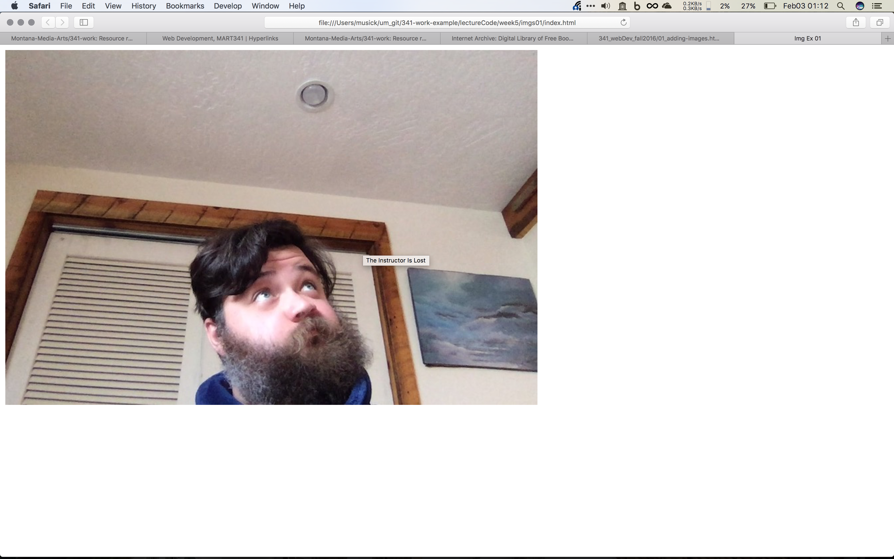

# Images
Images, unlike hyperlinks, use the URL source to retrieve additional data for the page, as opposed to sending the user to another page.

As I am _sure_ you can imagine, you will need use images a lot in web design and development.

## The Image Tag

As with the break (`<br />`) and horizontal ruler (`<hr />`) elements, the image element is an empty element that only requires a single tag. This tag is ``.

As with hyperlinks, this element is reliant on attributes within the tag to allow it to be useful.

#### Source (`src=""`)

The first attribute that we will need to consider is “`src=""`”. Within the double quotes you will need to include an URL to the location of the desired image. This will typically be a relative URL to a file stored on the same server as the web page, but can also be an absolute URL to an image anywhere on the Internet.

#### Alt Text (`alt=""`)

Proper style and accessibility standards dictate that you should always include the alt text attribute. The key for this is simply “`alt=""`”. The value in the double quotes should describe the image. This description is used by screen readers for those who are visually impaired. Therefore it is critical that you provide a detailed description, especially in the case where the image is necessary to understand the content of the page.

#### Title (`title=""`)

As with the Alt Text attribute, you should also get in the habit of always including a title attribute. Most browsers will display this text as a tooltip, when a user hovers their mouse over am image with the included attribute.

The alt and/or title attributes will also be used by some browsers in the case where the image itself cannot load.

You can try this for yourself at the following example page: [https://montana-media-arts.github.io/341-work/lectureCode/week5/imgs01/index.html](https://montana-media-arts.github.io/341-work/lectureCode/week5/imgs01/index.html). Simply hold your mouse over the image and you should see a tooltip pop up like this image of me doing the same thing in my browser. (pro tip: you can do that same thing to this image) 

#### width & height (`width="" height=""`)

Another set of attributes you should add every time is `width=""` & `height=""`. The values passed to these attributes are a string with an integer, representing the width and height that the image is to be displayed at.

In most situations, the width and height of the image file, should be the same width and height that you enter as attributes and want used in your web page. In the case that these differ, these attributes will scale the image file to the specified size passed to the attributes.

Another reason for including these attributes is that the web browser uses these to reserve the correct amount of space for the image on the page when rendering, even in the case where the page is rendered before the image file is delivered to the browser. This means that the page will not have to ‘re-render’ to accommodate an image that loads after the rest of the page.

### Example

The following is an example of the code used to add an image;

```html

```

Here is a link to the code used to create the live page from above: [https://github.com/Montana-Media-Arts/341-work/tree/master/lectureCode/week5/imgs01](https://github.com/Montana-Media-Arts/341-work/tree/master/lectureCode/week5/imgs01)

Please note directory structure and relationship of the `index.html` file and the image file.

```bash
.
├── imgs
│   └── instructorIsLost.jpg
└── index.html
```


## { TODO: }

- Please read Chapter 5 in the Duckett, which provides a comprehensive and thorough overview of image and the web.
- Read [Google Developer Site’s “Image Optimization”](https://developers.google.com/web/fundamentals/performance/optimizing-content-efficiency/image-optimization)
- Read the following article on ["The Hero Image Trend in Web Design"](https://envato.com/blog/exploring-hero-image-trend-web-design/)
- Look at AWWWARDS [BEST WEBSITES EXAMPLES OF DESIGNS WITH BIG BACKGROUND IMAGES](http://www.awwwards.com/websites/big-background-images/)
- Look at the following article on examples of effective use of images by [Gisele Muller](https://webdesignledger.com/20-examples-of-effective-image-usage-in-web-design/).

And if all else fails, and you have more questions about images and the web, ask Professor Twigg!
