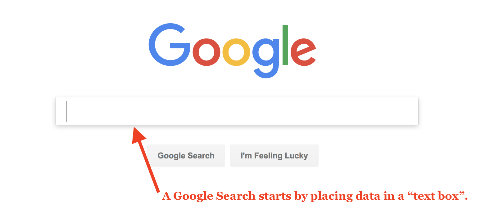

# Introduction to Forms

Forms and form elements are used by web developers to collect data & information from users on websites. This can include;

- drop down boxes
    - Multiple choices
- text entry
    - Usernames
    - Real Names
    - phone numbers
    - emails
    - etc
- radio checkmarks/buttons
    - "Which of the following applies"
- password input
    - Hidden text input
- buttons
    - Used for submitting information and navigating to new pages
- file uploads

The most common example of a form in use is a searchbox, such as Google or Bing.



### { TODO: }

Please read the following for basic information about forms:

- [How does a form work](http://www.simfatic.com/forms/help/v40/how_does_an_html_form_work_.html)

# The `<form>` Element

To include a form in a webpage we must declare a form element section. This is simply accomplished by using the `<form>...</form>` tags.

Between these tags will be separate "form elements" such as "text boxes" and "buttons" that we will discuss in the proceeding pages.

## Form Attributes

The following are attributes that you should always include in a form element tag.

### `action`

The `action` attribute is a link to a server-side script (i.e. a file on another computer, not the users computer). Typically this file is code file (php, javascript, python, java, etc) on a server that will do 'something' with the user data before returning information back to the browser.

The value of the action attribute will always be an URL.

### `method`

Forms can be sent using one of two methods; '`get`' or '`post`'.

With the '`get`' method, values are added to the end of the specified action URL.

This methods is ideal for searches, or for retrieving data from a server (as opposed to sending data that will be stored in a database).

With the '`post`' method, values are sent in what are known as 'HTTP headers'. As a rule of thumb, use the '`post`' method when;

- users are uploading a file.
- the data will be very long
- the data is sensitive (ie. contains passwords)
- The data is intended to alter or access a database on the server.

### `id` & `class`

As with many other elements in HTML, you should assign a unique element `id` and `class` that can be used by other languages to refer to the specific form.

## Form Code Example

```html
<form action="http://www.example.com/subscribe.php" method="get" id="basicForm">
    <!-- This is where the related form elements and controls will appear. -->
</form>
```
